## Admin Overview

The admin console is where you configure the system wide settings such as 3rd party services, billing configurations, visibility controls etc. 

To access the system admin navigate to https://console.fleetbase.io/admin/

### Organisations

View all of the organisations and users signed up to your Fleetbase instance. 

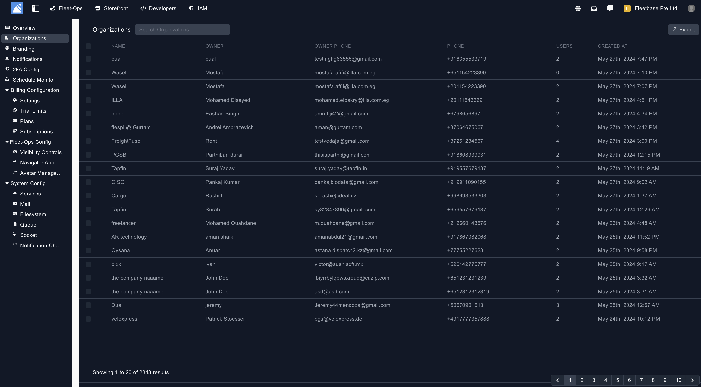

### Branding 

Upload your icon and logo for branding your Fleetbase instance. 

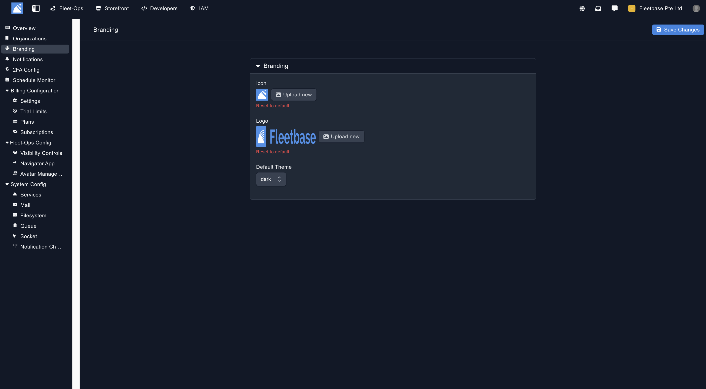

### Notifications 

Set up users to recieve system wide notifications. 

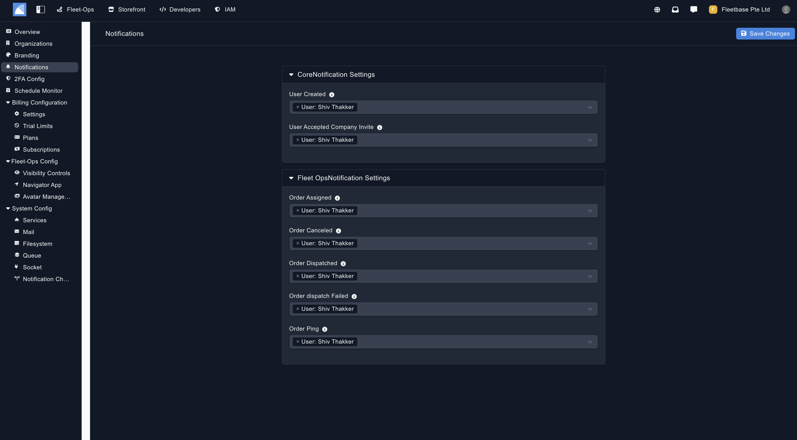

### 2FA Config 

Configure the 2FA functions for your Fleetbase instance. 

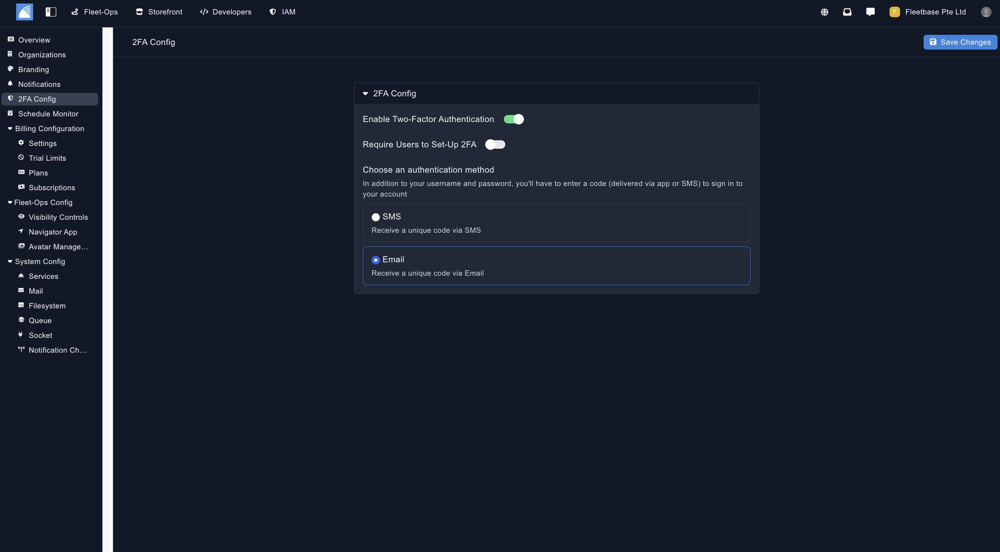

### Visibility Controls 

Select which FleetOps modules are visibile to the users of your Fleetbase instance. 

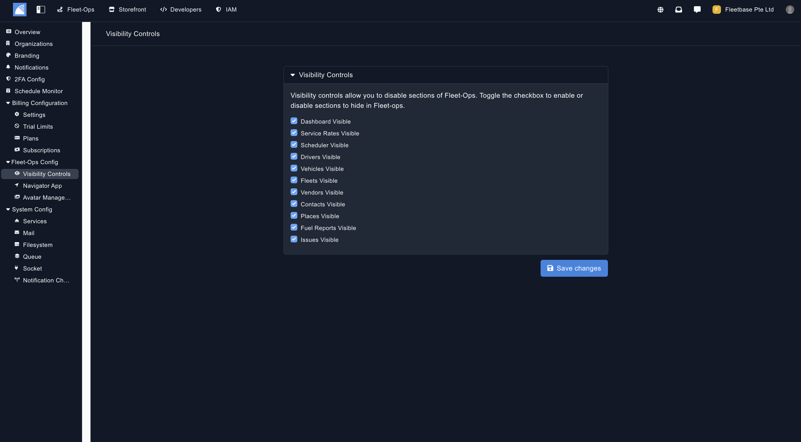

### Navigator App 

To use our existing published Navigator App with your Fleetbase instance, you need to create a instance linking URL. You can do so in the screenshot below. 

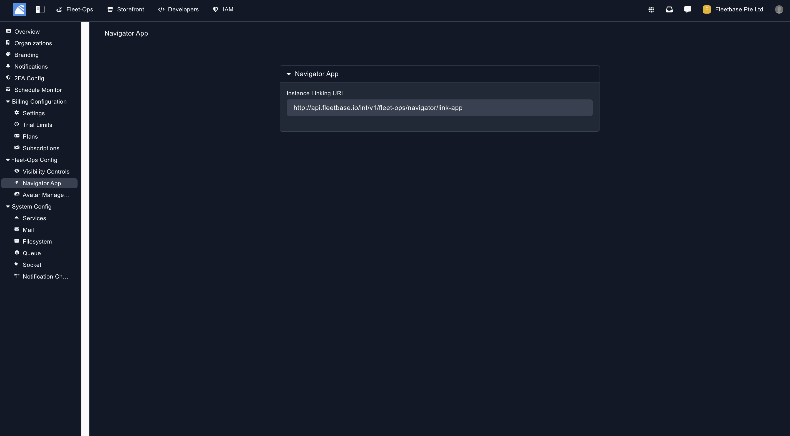

### Avatar Management 

Create an upload the avatars that you want users to use in your Fleetbase instance for vehicles, places and drivers. 

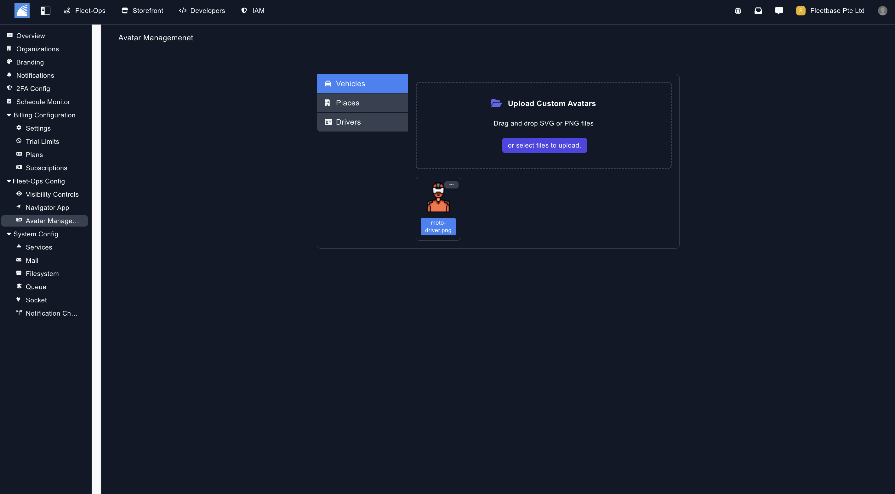

### Services

Add in your API Keys for 3rd party services such as Google Maps, AWS, Twilio & Sentry in the Services section. 

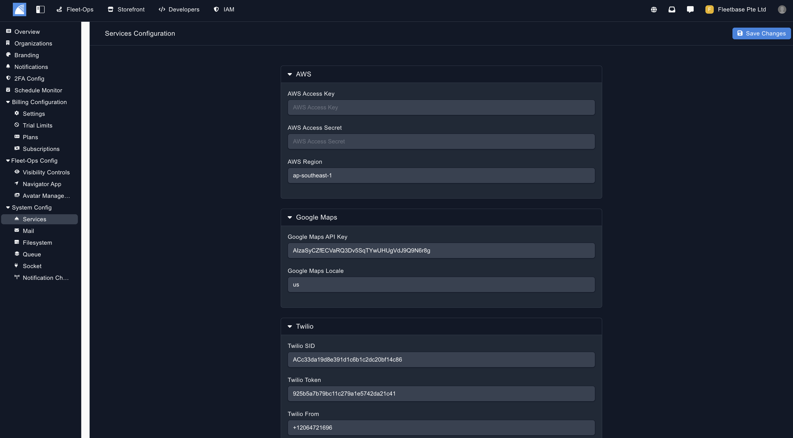

### Mail Config 

Set up your mail server for sending emails from your Fleetbase instance.

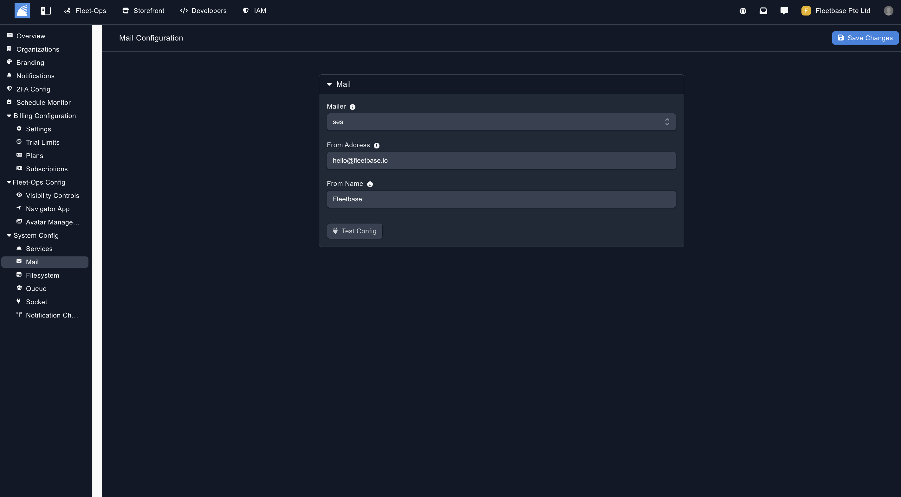

### Filestorage 

Set up your file storage configurations so users can upload files in your Fleetbase instance. 

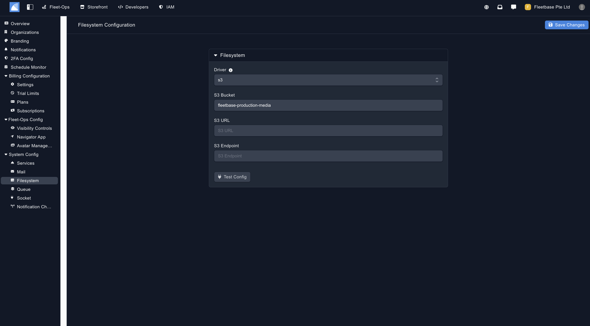

### Queue Config 

Set up your queue service for your Fleetbase instance. 

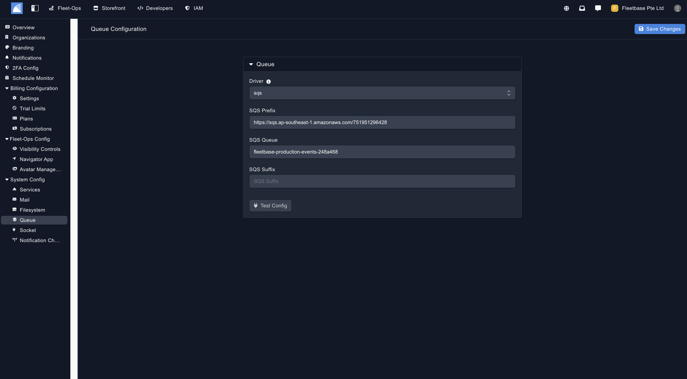

### Socket Cluster 

Test socket connection. 

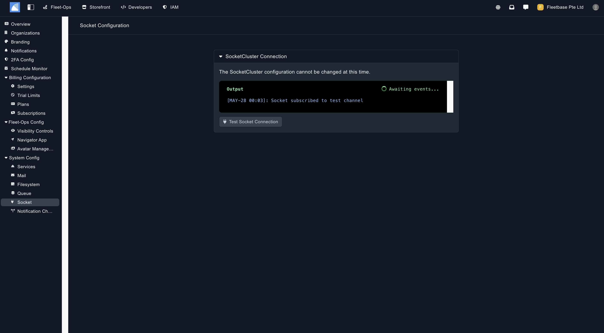

### Notification Channels

Set up notifications system wide for your Fleetbase instance. 

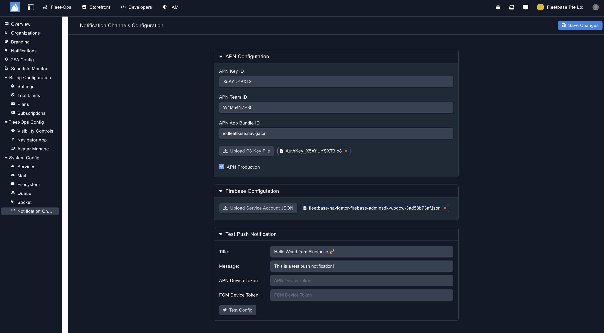

