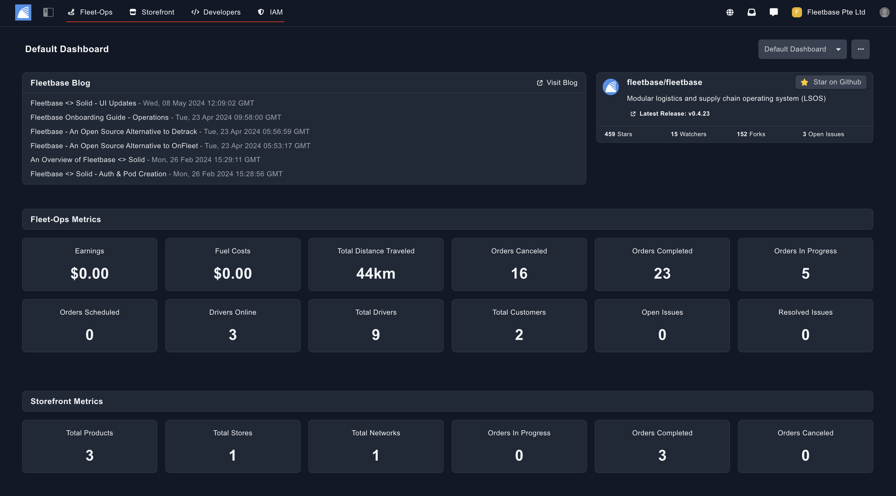
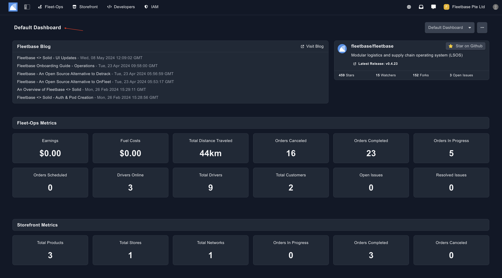
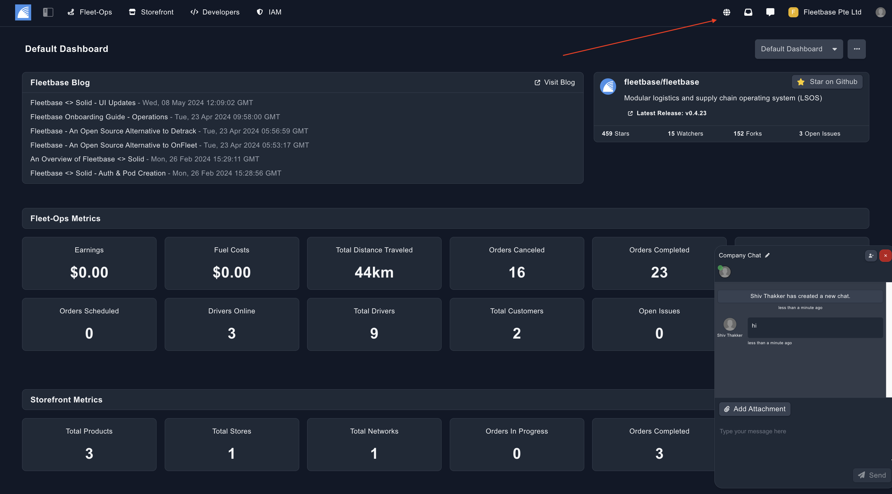
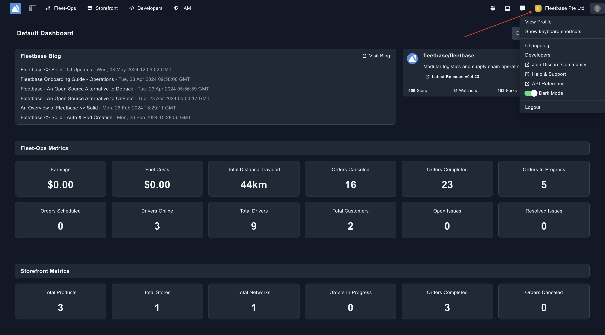

## Console Overview

The console is the backbone of Fleetbase. It shows all of your installed extensions, cutomized dashboards and your company / user settings. 

### Navigation Bar

The top navigation bar shows all of your extensions currently available.

### Dashboard

As you enter the console, you will see the Dashboard. 

This dashboard is fully customizble, you can learn more in the Dashboard Section. 

### Notifications / Chat / Translation
 
View all of your system notifications, switch to multiple languages and create instant chat channels using the features in the screenshot below: 

### Company & User Settings

Click into the Company Name or the User Profile Image to access settings such as: 

- Organisation Settings
- Create or Join or Switch Organisations
- Update Billing Settings
- Explore Extensions
- Access System Admin
- View or Update Profile / Passwords

