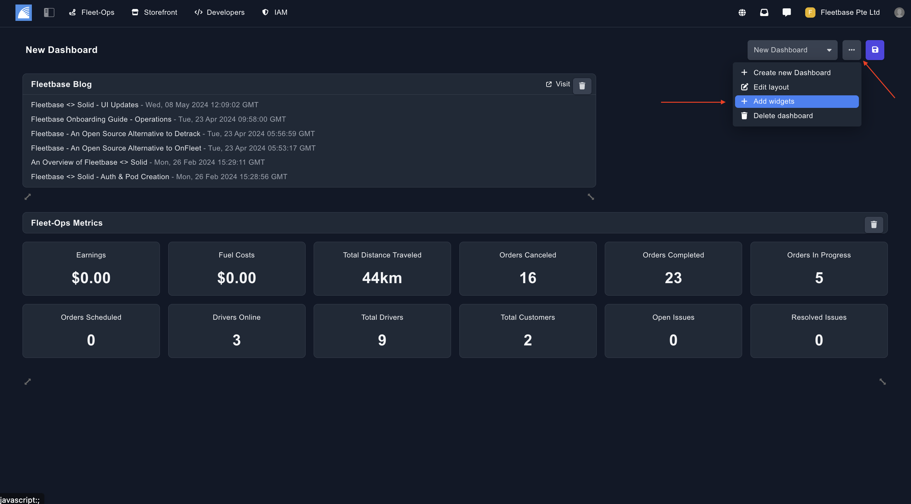
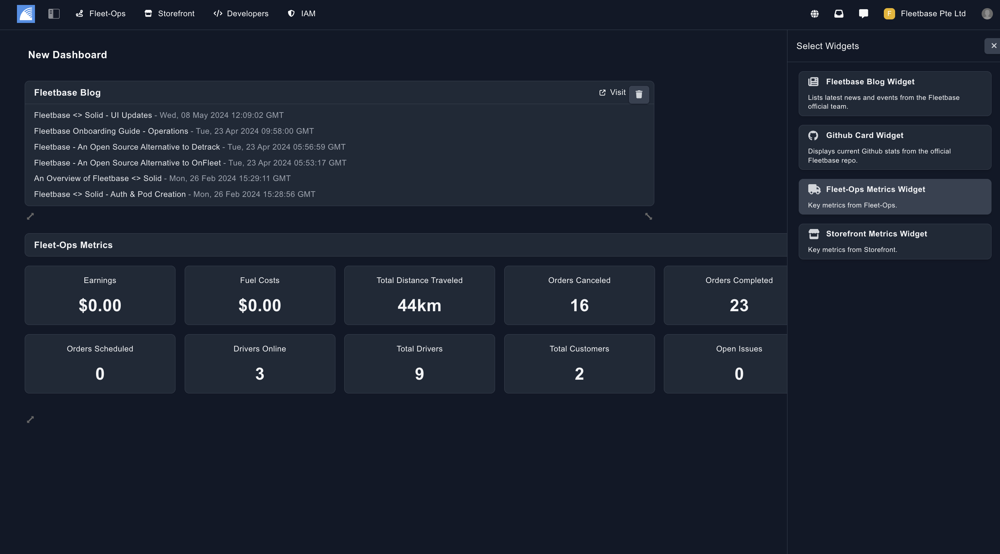

## Widgets 

The dashboard is compiled of 'Widgets'. Fleetbase comes with standard widgets for insights into metric for FleetOps and Storefront. Users can create their own custom widgets or reach out to one of our team for the same. 

### Create New Widget

Once you have created a new Dashboard, you can then add the exisiting Widgets to this dashboard. 

Click on the ... dots on the right top corner, and then click 'Add Widgets'. 

Once you are here, you can select the widgets you need. If you are looking to create new widgets, you can do so from the back end, or reach out to the team. 

