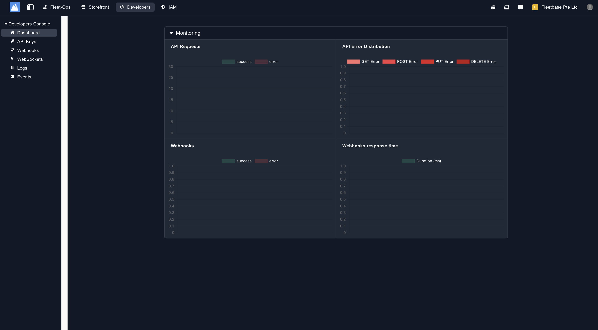
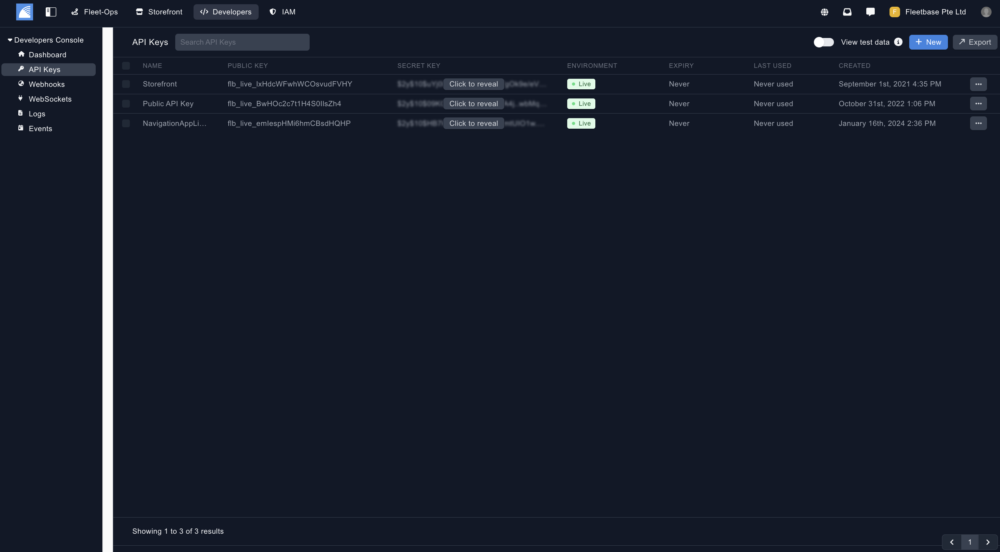
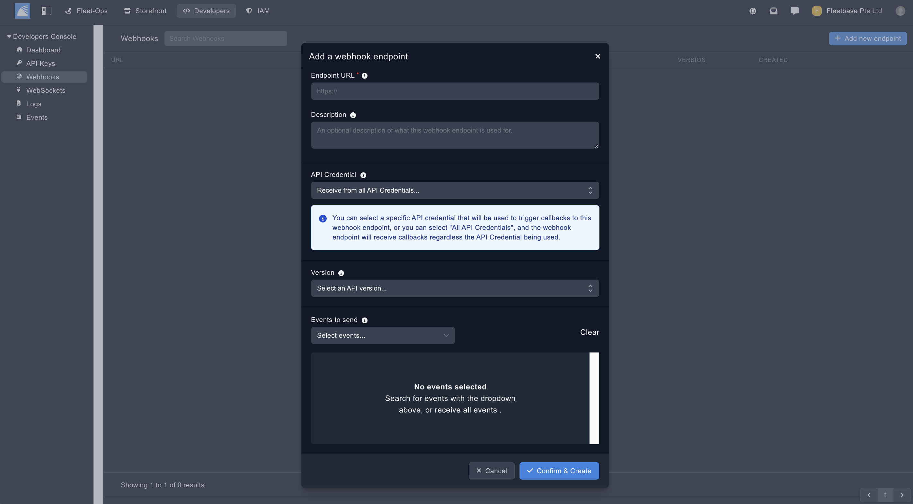
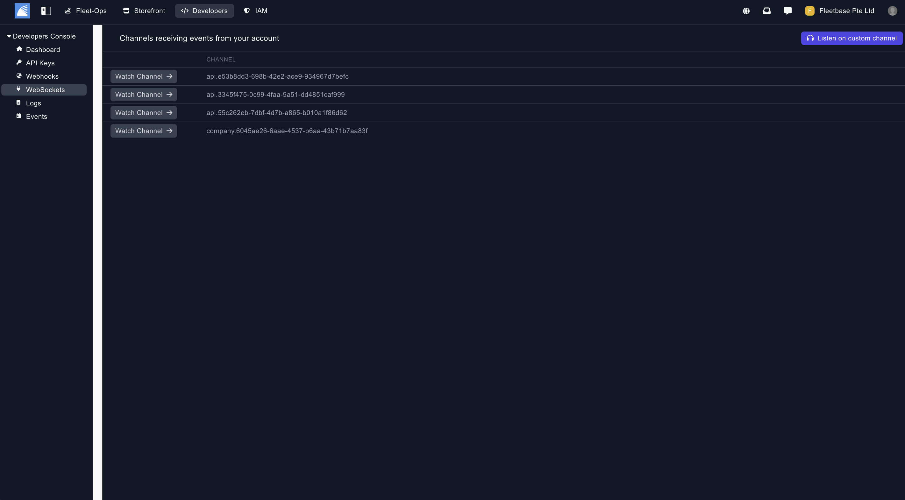
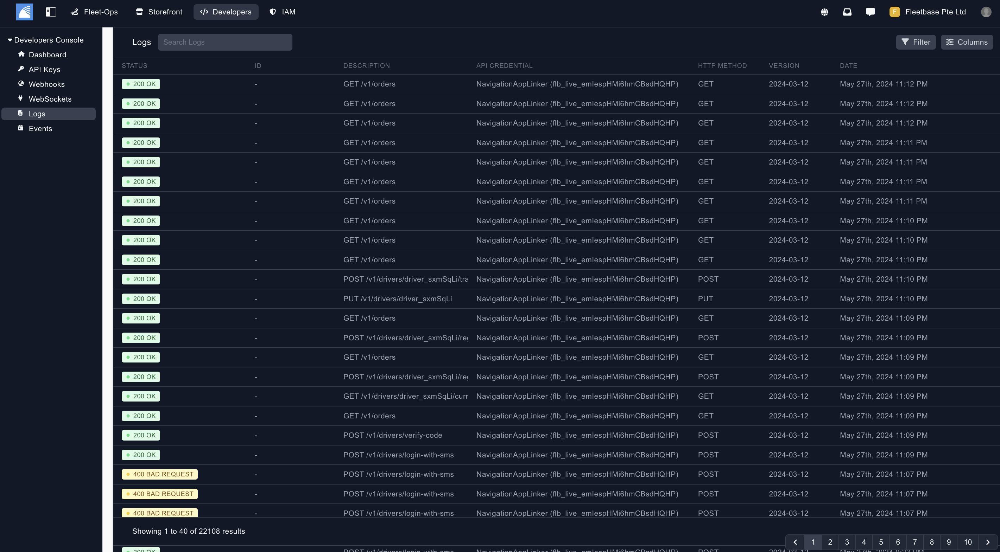

## Overview

The Developers console allows you to have an overview of your activity, and create the API Keys and Webhooks you need to integrate and run Fleetbase programatically.

1. **Insights** - View API insights.

2. **API Keys** - Create and view API Keys. 

3. **Webhooks** - Create and view webhook endpoints.

4. **WebSockets** - View your webhooks success and errors.

5. **Logs** - View all of the logs for your account.

6. **Events** - View all of the logs for your account.

