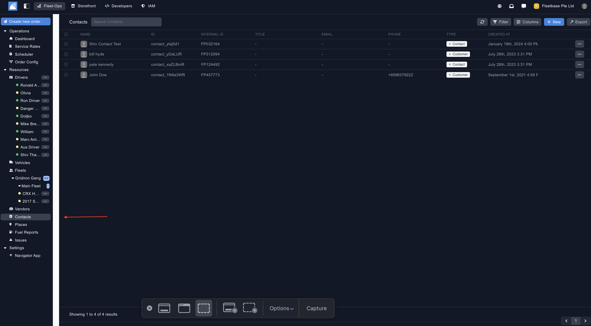
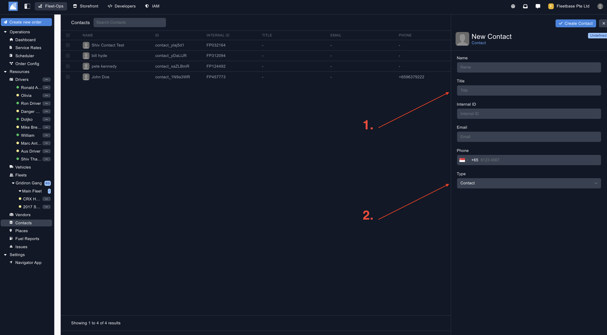
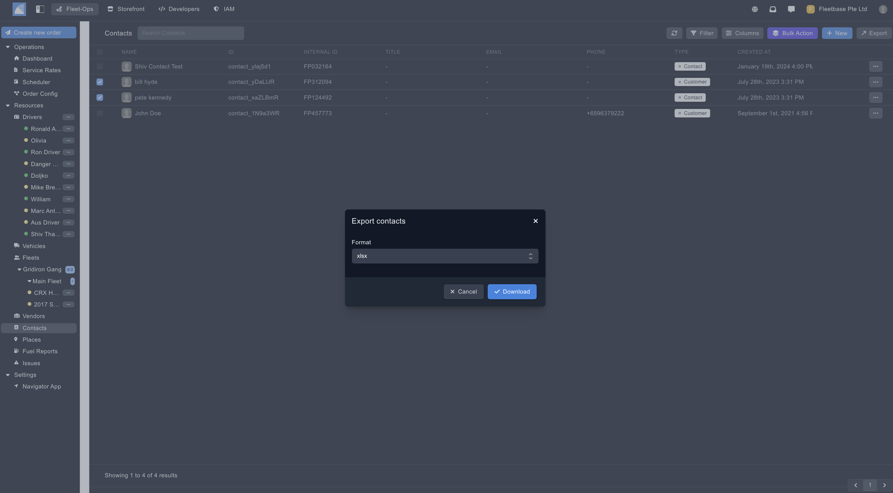

## Overview

Contacts can be defined in multiple ways. 

1. **Contacts** - Contacts can be any contacts you wish to document in the system, such as contractors / stakeholdersetc. 
2. **Customers** - Customers can be the end customer your want to assign deliveries to. 

### Create Contact / Customer ###

You can create a new contact by clicking on the button on the top of the panel.

1. **Contact Details** - Populate your contact / customer details.
2. **Type** - Select from the list to select either 'Contact' or 'Customer'. 

### Export Contacts ###

Export contacts by selecting the contacts and then clicking the 'Export' button. 

