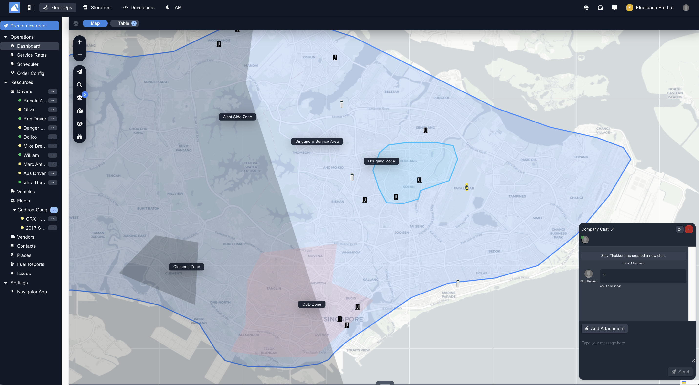
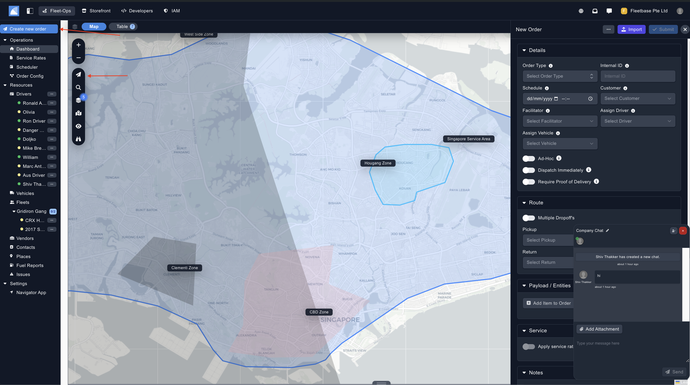
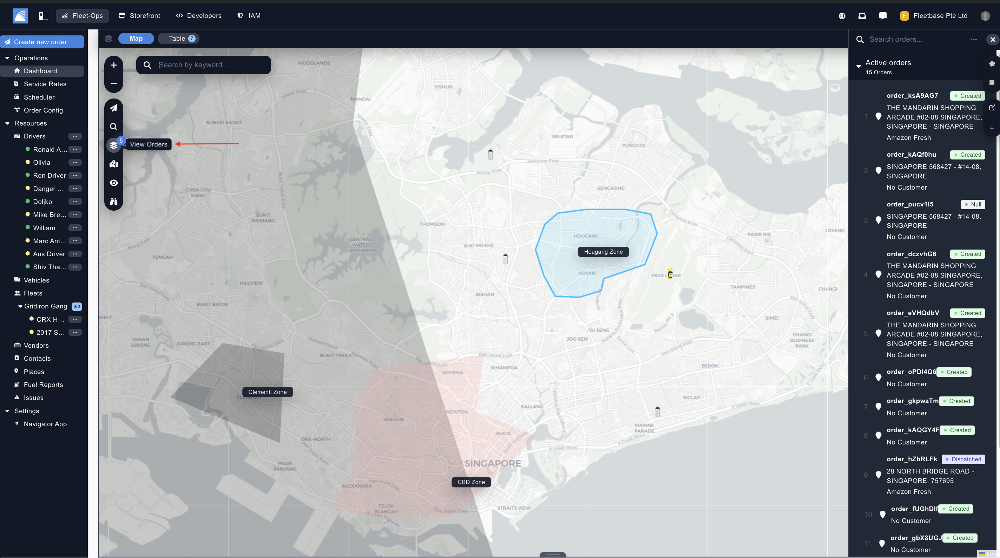
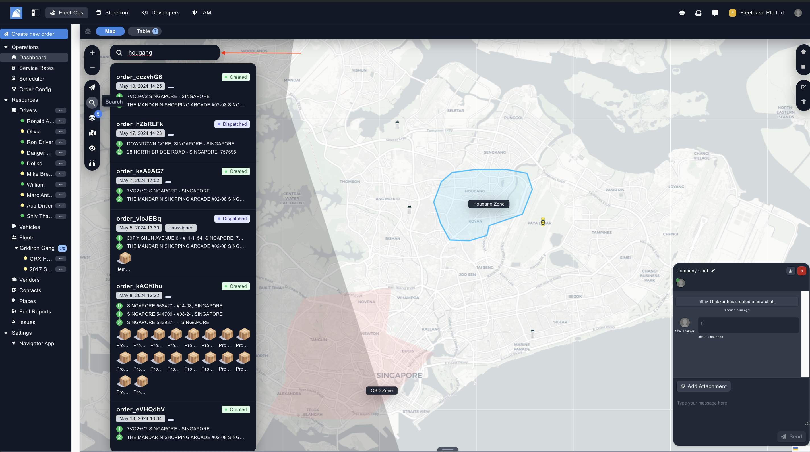
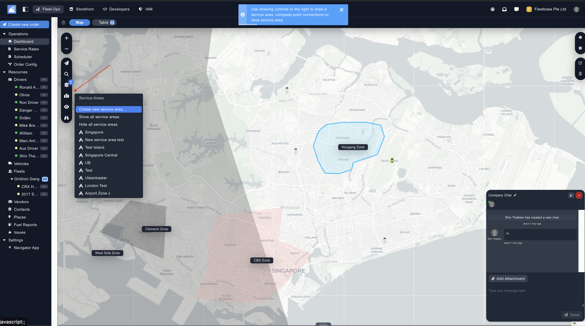
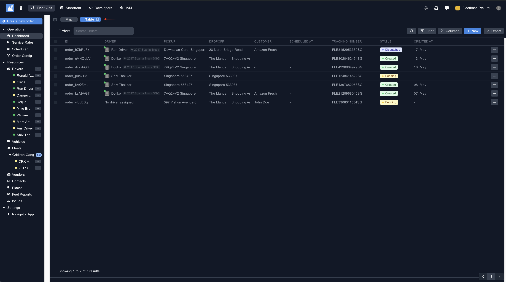
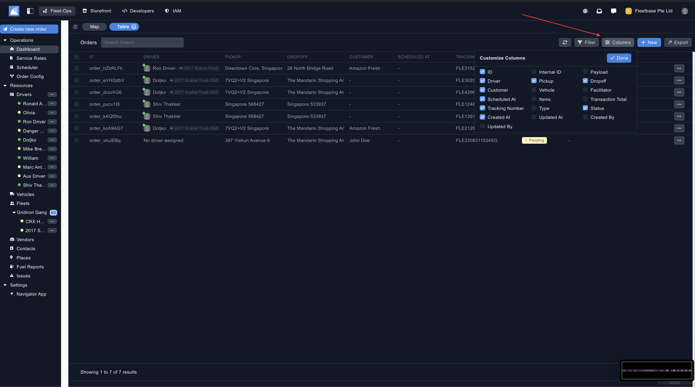
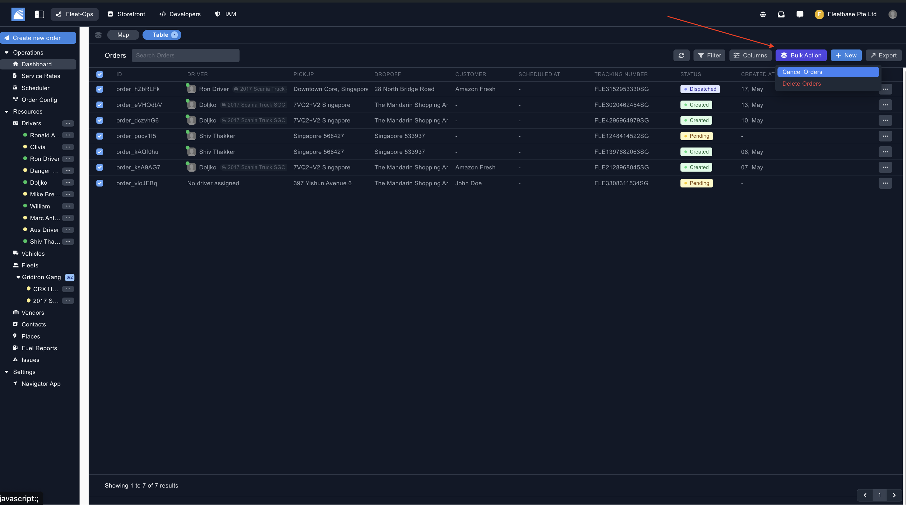

## Overview

The map view in FleetOps is probabsly where you will spend most of your time. 

Here, you can have a full overview of all of your drivers locations in real time, as well create and view orders, create and view service areas and add custom zoning. 

### Map View

The map view shows a visual representation of the drivers, this is using the GPS from the mobile device, as long as the driver is online using the Navigator App you will be able to see their location. 

#### Create Order

You can create an order directly from the dashboard by clicking on the 'Create New Order' button, or by clicking the first button in the left side bar. 

Navigate to the 'Orders' section to learn more. 

#### View Orders

You can view orders directly from the dashboard by clicking the 3rd button on the left side bar. 

Navigate to the 'Orders' section to learn more. 

#### Search 

You can search for your order by simply clicking the second button on the left side bar, and then searching in the box above. 

 

#### Create Service Areas

You can create an service area directly from the dashboard by clicking on the 'Create New Service Area' button, or by clicking the fourth button in the left side bar. 

Navigate to the 'Service Areas' section to learn more. 

### Table View

The Table View in FleetOps shows a full list of the orders created by the users in FleetOps, from here, you can bulk action orders, see the statuses of orders, and export all of your order details. 

#### Custom Columns

Users can view and hide all of the columns they want to see in the table view. Simple click the columns tab and check or uncheck the required fields. 

#### Bulk Actions

Once you select orders from the Table View, you can commit bulk actions on these orders. Simply navigate to the 'Bulk Action' button on the top right. 

