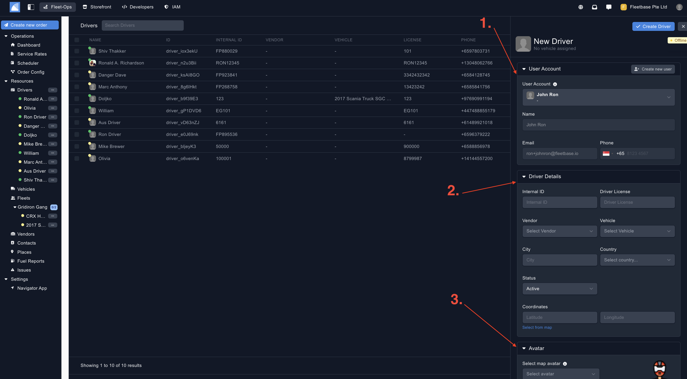
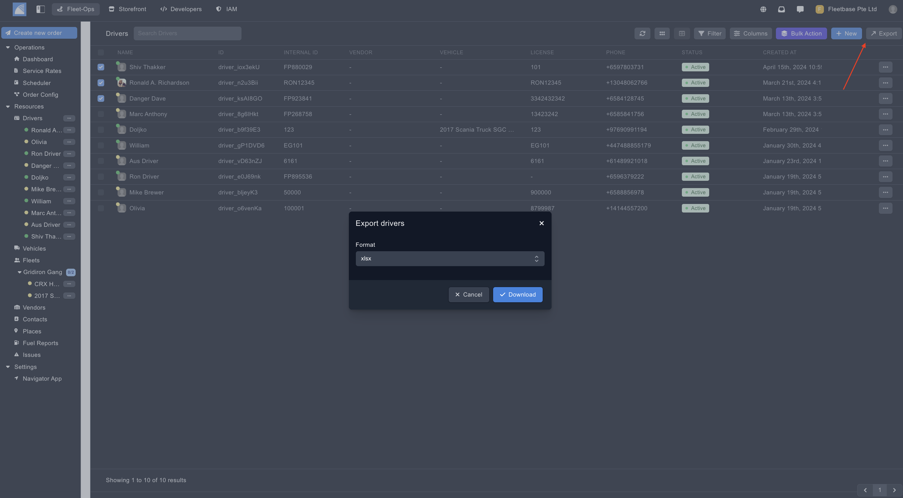

## Overview

Drivers can be used to assign new orders, vehicles and fleets to. 

### Create Drivers

You can create new orders by clicking on the button on the top of the panel.

1. **User Account** - If the driver has an exisiting user account in the system, you can link this account to create the new driver. 
2. **Driver Details** - Add in the details of the driver. 
3. **Avatar** - Select an avatar, this will be displayed when you view the driver on the map. 
4. **Navigator App** - The phone number you add to the driver will be used to login to the Driver app once you assign the order to them. 

### Export Drivers ###

Export drivers by selecting the drivers and then clicking the 'Export' button. 

