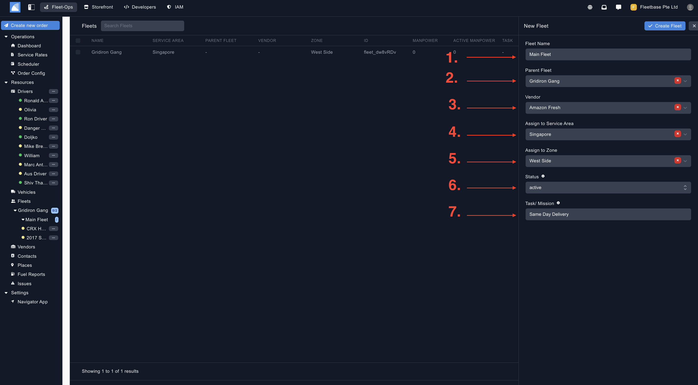
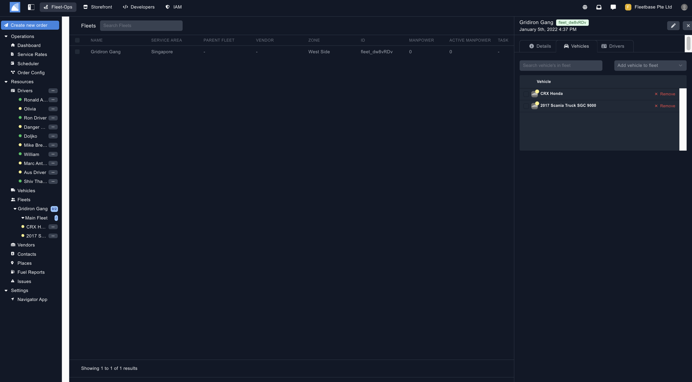
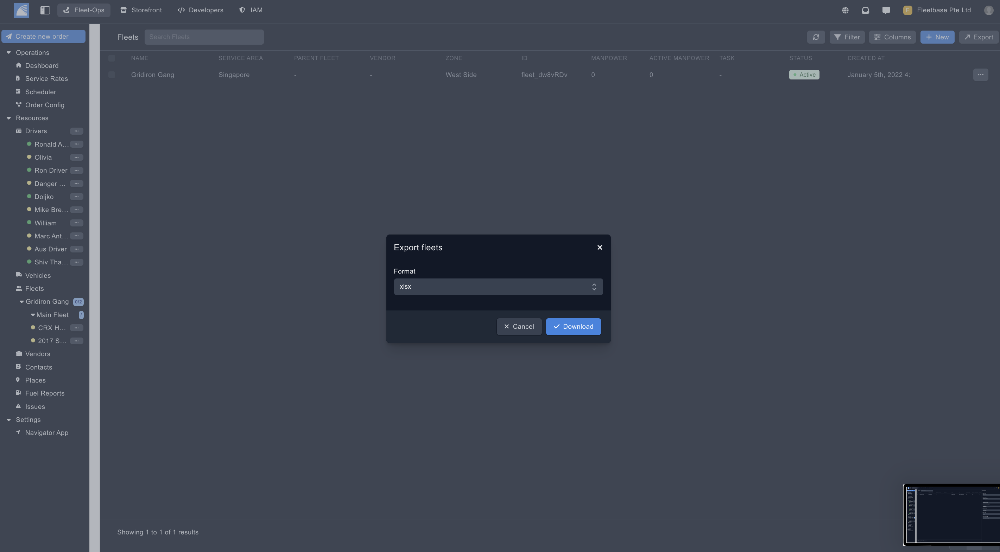

## Overview

You can group drivers & vehicles to Fleets. This can then be used to assign Fleets to specific service areas or zones.

### Create Fleets

You can create new fleets by clicking on the button on the top of the panel.

1. **Fleet Name** - Add in the name of the Fleet.
2. **Parent Fleet** - This is your Fleet hierarchy, you can create a fleet and then sub fleets under it. 
3. **Vendor** - Vendors can be 3rd party logistics companies that you assign order to, you can assign a Fleet to a Vendor. 
4. **Assign to Service Area** - If you have multiple Fleets, you can assign specific Fleets to Service Areas. 
5. **Assign to Zone** - Assign this Fleet to a specific Zone. 
6. **Status** - Set if this fleet is active or not. 
7. **Task / Mission** - Define the mission for this Fleet. 

### Assign Drivers & Vehicles ###

Once you have created the Fleet, click the three dots and click 'View Details'. From here, you can assign the specific drivers and vehicles to this Fleet. 

### Export Fleets ###

Export vehicles by selecting the drivers and then clicking the 'Export' button. 

