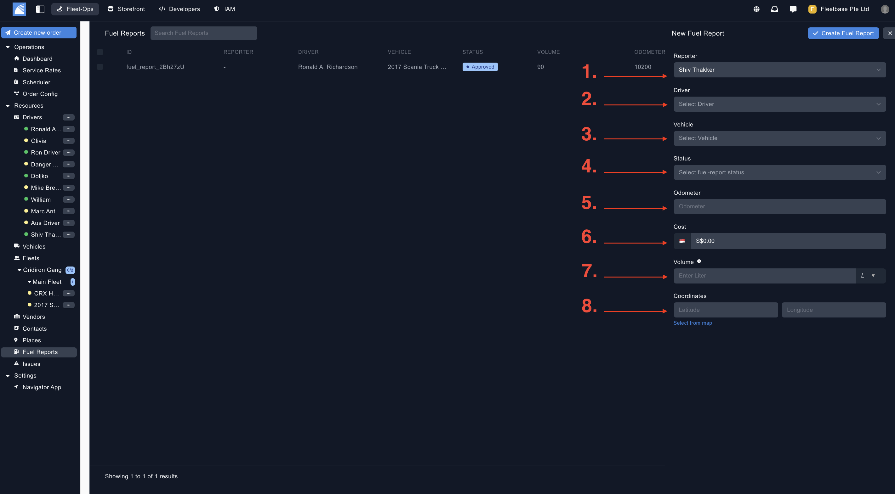
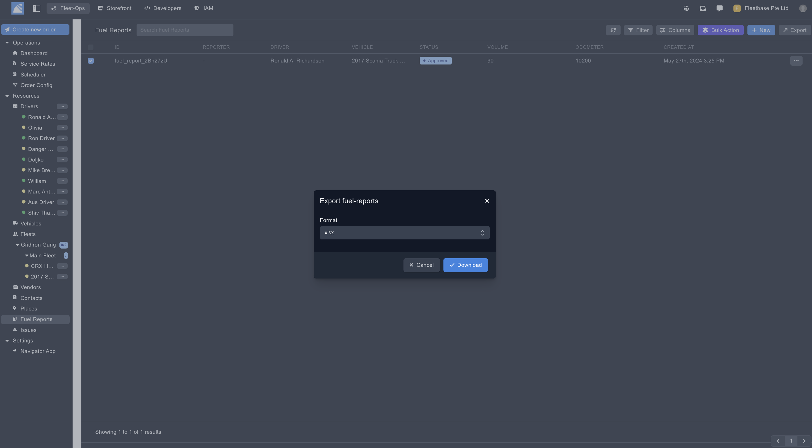

## Overview

You can upload and track fuel reports for your fleet.

### Create Fuel Reports ###

You can create a fuel reports by clicking on the button on the top of the panel.

1. **Reporter** - Select the user who is submitting this fuel report.
2. **Driver** - Select the driver that is submitting this fuel report. 
3. **Vehicle** - Select vehicle that this fuel report relates to. 
4. **Status** - Select the status of the fuel report, if it is in draft mode or published etc. 
5. **Odometer** - Populate the current odometer reading at the time of this fuel report. 
6. **Cost** - Populate the cost of this fuel report. 
7. **Volume** - Populate the liters that have been added for this fuel report. 
8. **Coordinates** - Select the coordinates that relate to this fuel report. 

### Export Fuel Reports ###

Export fuel reports by selecting the fuel reports and then clicking the 'Export' button. 

