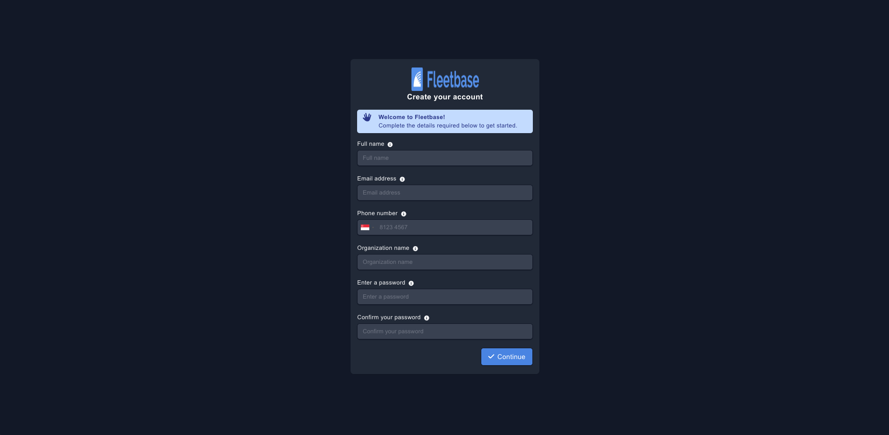
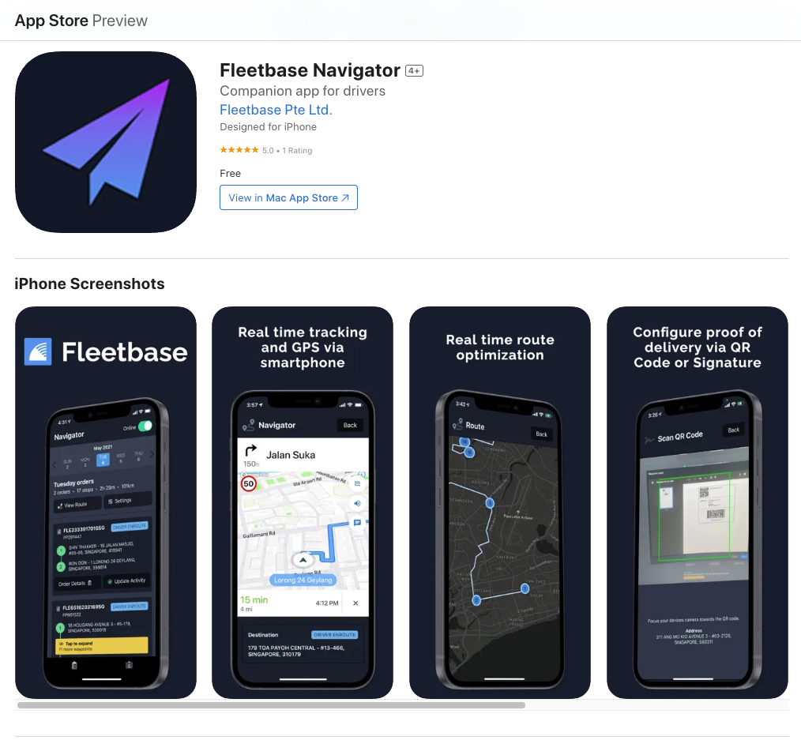
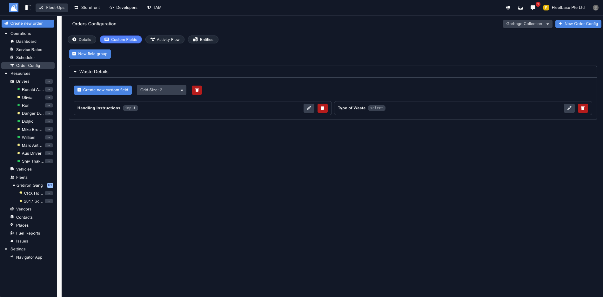
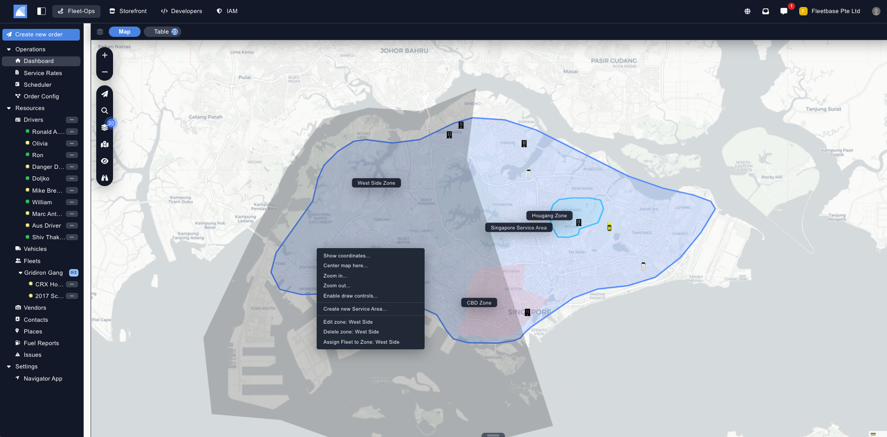
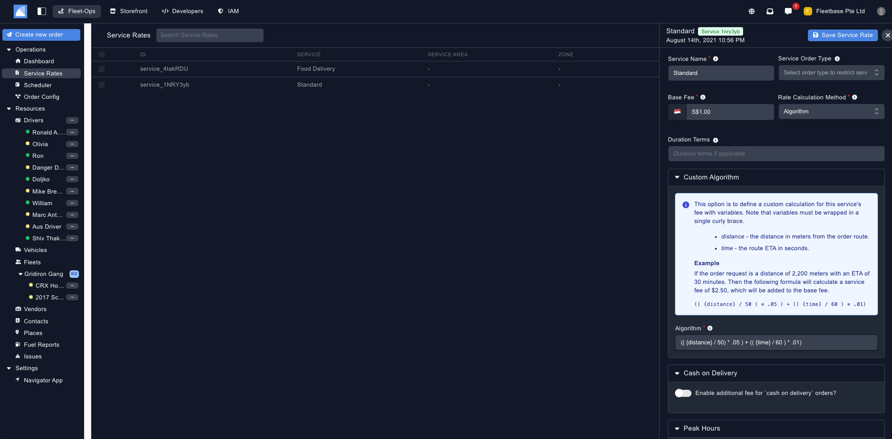
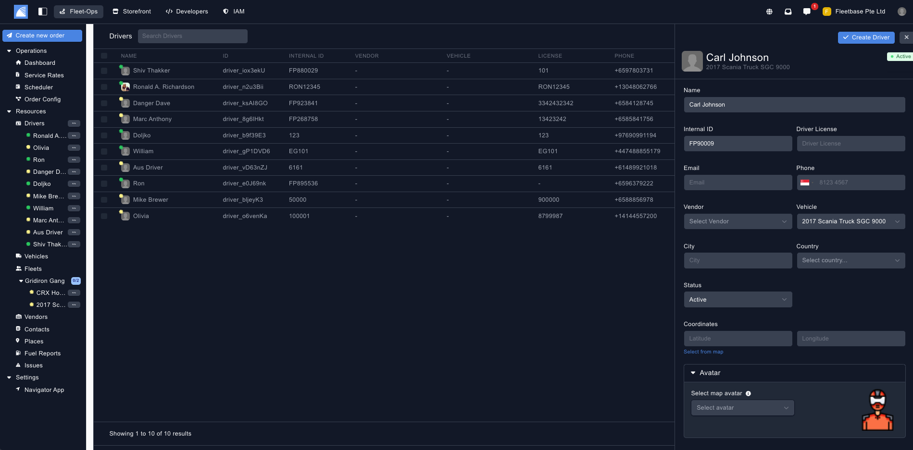
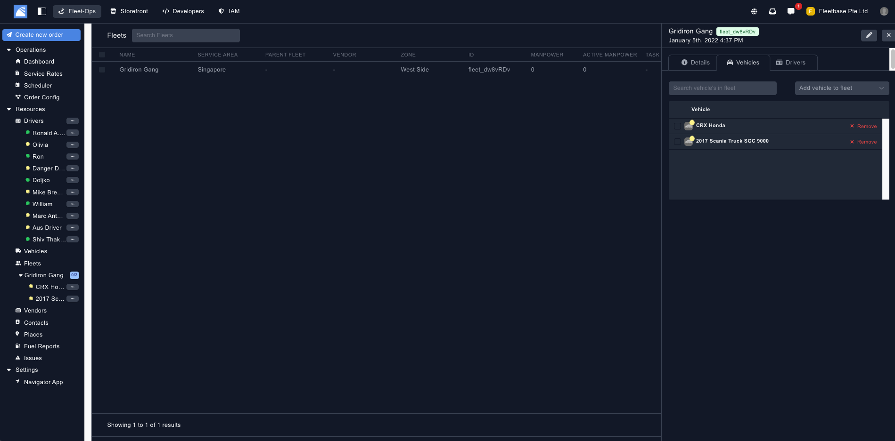
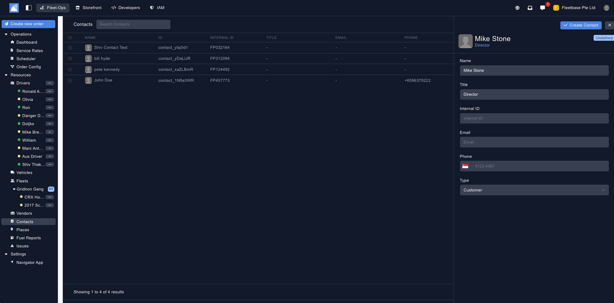
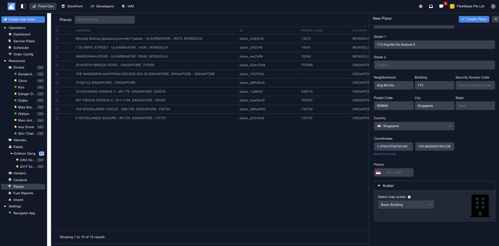
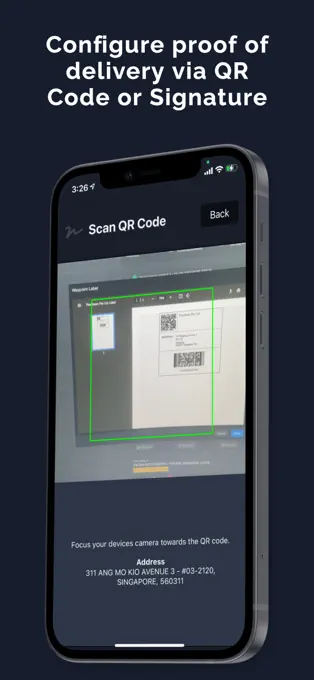

## Get Started With FleetOps ##

### 1. Sign Up ###

‍The first step to revolutionizing your logistics operations is to sign up for Fleetbase. It's as simple as following this link and filling in a few details.

### 2. Invite Users ###

Invite your team members to join the platform, assign roles, and empower everyone to contribute to your fleet's success.

### 3. Download Driver App ###

‍Download the Fleetbase Navigator App on your iOS or Android device to take your fleet management wherever you go.

Once you create a Driver within Fleetbase you can login to the Navigator App using the mobile you have assigned to that Driver.

### 4. Configure Your Operations Flow ###

Fleetbase can be fully customised to for your operations flow, whether your company conducts food delivery, garage pick up, courier services or logistics operations processes.

Head to the Order Config within Fleetbase and follow the below step: 

1. Create New - Click 'New Order Config' and enter your operation flow details. ‍

2. Custom Fields - Create as many custom fields as you like, these fields will appear in the Order Form

3. Activity Flow - Create custom activity flow statuses. These status are each activity point the driver either needs to update or gets updated automatically.
‍

### 5. Create your Service Areas ###

Define service areas and zones within Fleetbase to optimize your routes and streamline your deliveries.

### 6. Set Up Custom Service Rates ###

‍Our platform offers advanced algorithms to help you create custom service rates that reflect your business objectives.

### 7. Invite Your Drivers ###

‍Your drivers are the backbone of your fleet, and Fleetbase makes it easy to manage them efficiently. Add drivers to your fleet, track their assignments, and ensure seamless communication at all times.

### 8. Equip Your Fleet ### 

‍From trucks to vans to bikes, add vehicles to your Fleetbase account in Fleets and keep track of their performance, maintenance schedules, and more. Your fleet, your rules!

### 9. Keep Contacts & Customers Organized ###

‍Managing contacts is a breeze with Fleetbase. Add clients, suppliers, and partners to your contact list and streamline communication for smooth order processing.

### 10. Manage Delivery Locations ###

‍Simplify your delivery logistics by adding places to your Fleetbase account. Whether it's a client's office or a warehouse, easily access and manage all your delivery locations in one place.

### 11. Seamlessly Create Orders ### 

‍Ready to kickstart your operations? Create orders seamlessly within Fleetbase, specifying all the necessary details for smooth execution, from pickup to delivery.

### 12. Stay Updated in Real-Time ###

‍Keep track of your order's progress by updating its activity in real-time. From order acceptance to delivery confirmation, stay informed every step of the way.

### 13. Close the Loop with POD ### 

‍Complete proof of delivery (POD) for your orders to finalize the transaction and ensure customer satisfaction. Capture essential information such as signatures and timestamps to confirm successful deliveries.

