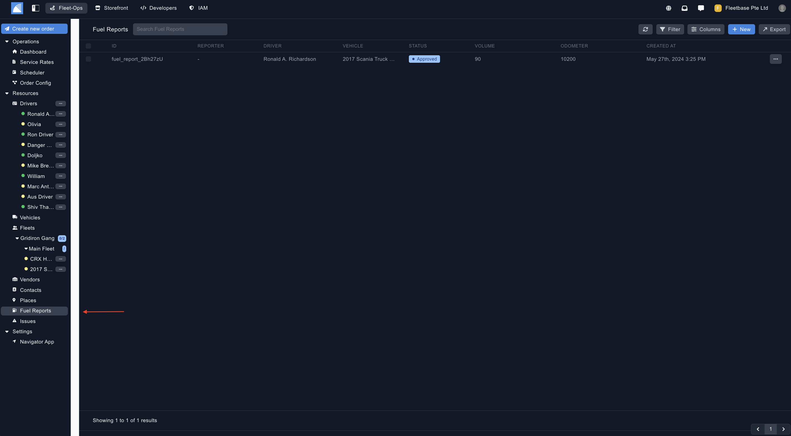
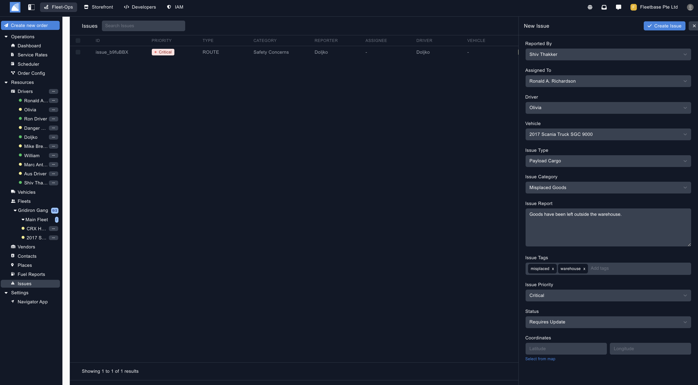
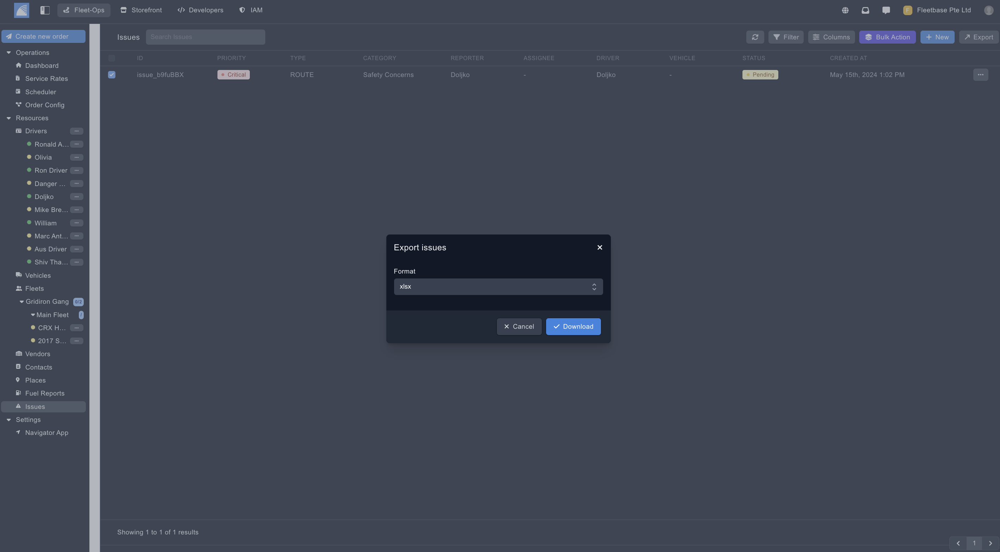

## Overview

Operations can create and track issues in real time as they occur in the field. This can be created here and also by the driver on the Navigator App. 

### Create Fuel Reports ###

You can create a fuel reports by clicking on the button on the top of the panel.

1. **Reported By** - Select the user who is reporting this issue.
2. **Assigned To** - Select the user that is required to resolve this issue. 
3. **Driver** - Select the driver assigned to the issue. 
4. **Vehicle** - Select the vehicle assigned to the issue. 
5. **Issue Type** - Populate the type of issue. 
6. **Issue Category** - Select the category of the issue. 
7. **Issue Report** - Describe the full details of the issue. 
8. **Issue Tags** - Add multiple tags for this issue for easier searching. 
8. **Issue Priority** - Select the priority of this issue. 
8. **Status** - Select tcurrent status of this issue. 
8. **Coordinates** - Select the coordinates that relate to this iisue.

### Export Issues ###

Export issues by selecting the issues and then clicking the 'Export' button. 

