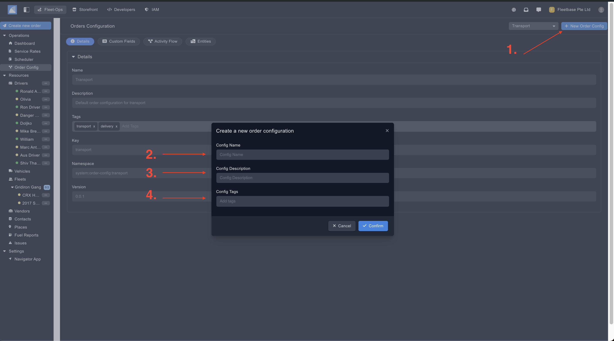
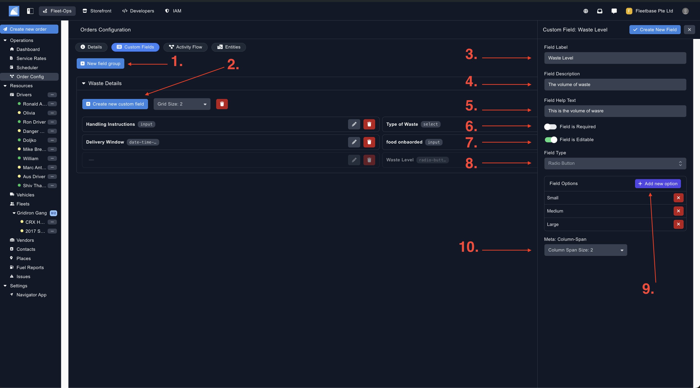
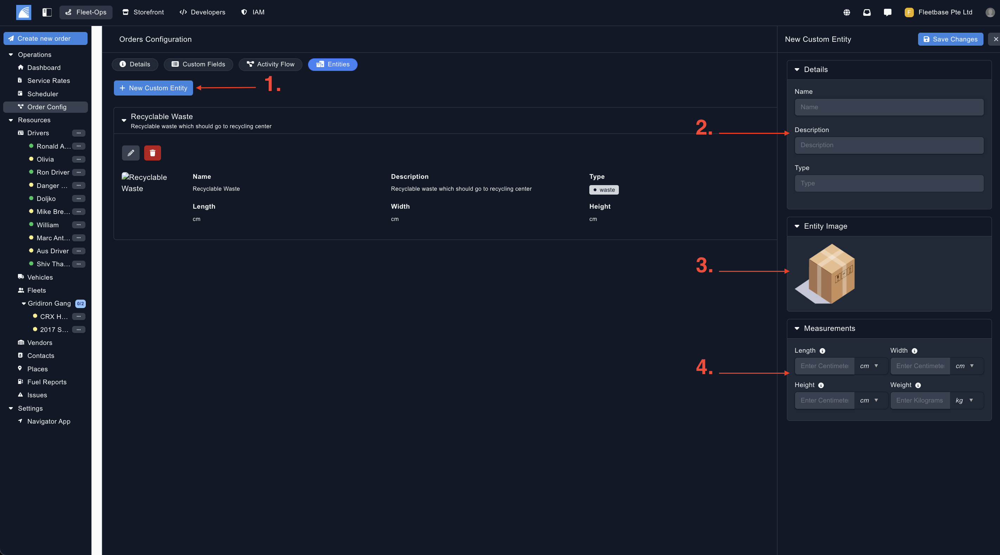

## Overview

The order configuration section in Fleetbase is the backbone of what fields are included when a new order is created, the activity flow and the activity statuses of the orders, and also the type of entity that is attached to the order. 

When creating a new order, once you specify the order type, this will pull in the fields and logic configured in that particular order configuration. 

### Creating New Order Configuration

1. **New Order Config** - Click here to create a new order configuration.
2. **Config Name** - Set the name of the configuration.
3. **Config Description** - Set the description of the order configuration. 
4. **Config Tag** - Set tags for this order configuration. 

### Select Order Configuration 

From the drop down, you can see all of the order configs you have created, select one to view the details, custom fields, activity flows and entities. 

### Creating Custom Fields

Custom fields can be created and importing into the new order form when creating a new orders. This can be for additonal fields that are not in the basic order forms. These fields can also be used to create custom activity logic as well.

1. **Create Field Group** - Click here to create a group of fields, you can create as many as you like.
2. **Create Field** - Click here to create the custom field, this will sit within the field group.
3. **Field Lable** - This is the name of the field. 
4. **Field Description** - This is the description of the field. 
5. **Field Help Text** - Set a help text for this field. 
6. **Field Is Required** - If this is toggled, you wont be able to submit the order without this field populated. 
7. **Field Editable** - If this is toggled, you will be able to edit this field. 
8. **Field Type** - You can select from a number of different field types, such as date / time input, money input, radio button etc. 
9. **Field Option** - If you select radio button, you can add in different options for the user to choose from.
10. **Column Span** - You can choose how many columns this field will span over. 

Once you have finished, click 'Create New Field', this will be available when you create a new order and select this order config.

### Creating Custom Activity Flow 

Cutsom activity flows can be created so that specific logic conditions can be created, depending on the companies requirements. These activity flows will be what the driver and the operations staff will have to confirm through, before the order can be completed. For example, you can create 

1. **Order Status** - You can see each order status and the details here, when you add a new status, it will appear in this flow chart.
2. **Create New Status** - Click the + button to create a new order status and pull out the activity status details.
3. **Status Key** - Enter a key that will be used for programatic decision making.
4. **Status Code** - This is where you can set a unique identifier. 
5. **Status** - This is what you will set to show the status to the end customer. 
6. **Details** - This is the details of the status that will be sent to the end customer. 
7. **Completes Order** - If this is toggled, this status will complete the order. 
8. **POD** - If this is toggled, this status will require a proof of delivery
9. **Select POD** - Select from the different types of proof of delivery.
10. **Activity Logic** - This is where (from your custom fields) you can set custom logic conditions. You can create as many logic conditions as you like. Please reach out to us if you need more assistance with this.  
11. **Events** - Add a specific event to this status.

Once you have finalised, click save. 

### Creating Custom Entities

Entities in Fleetbase are the types of specifics of the payloads that are moving moved. 

For example, here you can create containers, parcle types, waste types etc etc. 

Again, once you create an entitiy type, once you pull this specific order configuration in, then these entities will be assigned to the order as well. 

1. **New Custom Entity** - Click here to create the new custom entity.
2. **Details** - Populate the main details of the entity, for example the Name, Description & Type. 
3. **Image** - Add in a new image for this entity.
4. **Measurements** - Set your custom measurements for the entity. 

Once you save, your custom order config will be completed, please see the 'Order' section for steps on how to create a new order.
