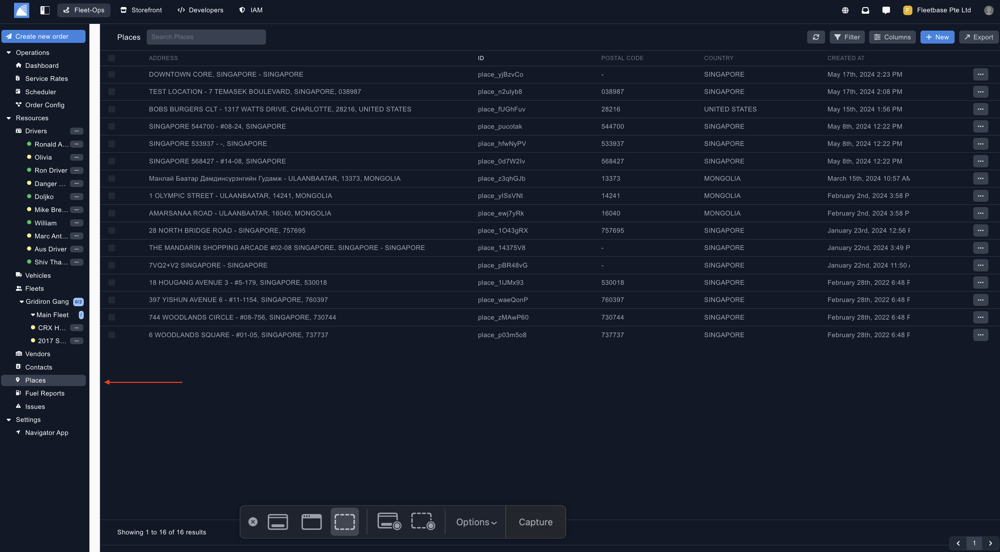
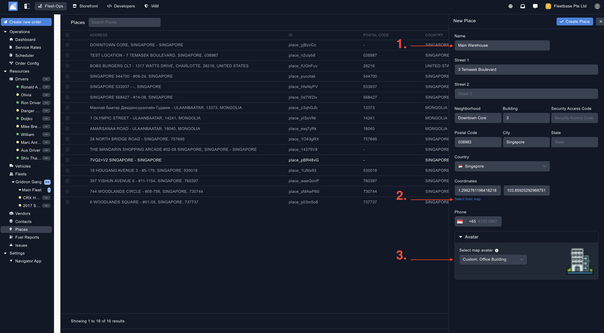
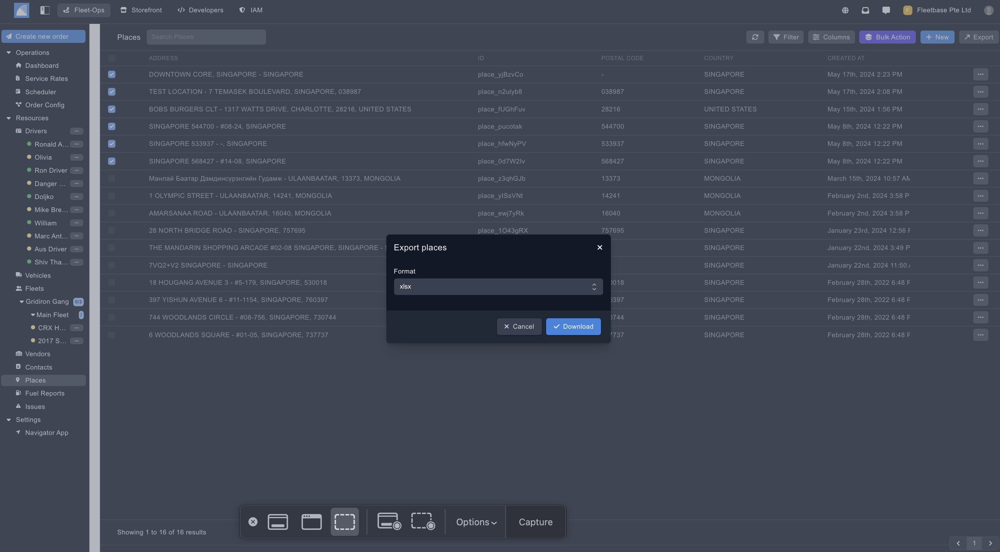

## Overview

Places are used to assign waypoints to orders. Places can be automatically created when the order is created, or you can create them manually and assign when creating the order.

### Create Place ###

You can create a new place by clicking on the button on the top of the panel.

1. **Name** - Populate the name for this place, you can search by this name when creating the order.
2. **Select From Map** - Add in the address by selecting 'Select from map', once you do this, the form will auto populate. 
3. **Avatar** - Select the custom avatar to view the place on the map. 

### Export Places ###

Export places by selecting the places and then clicking the 'Export' button. 

