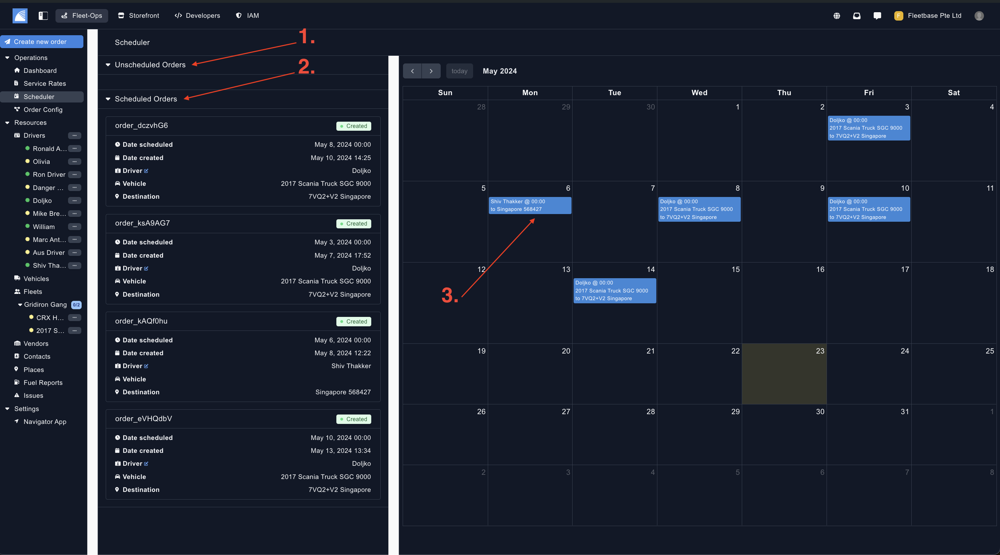
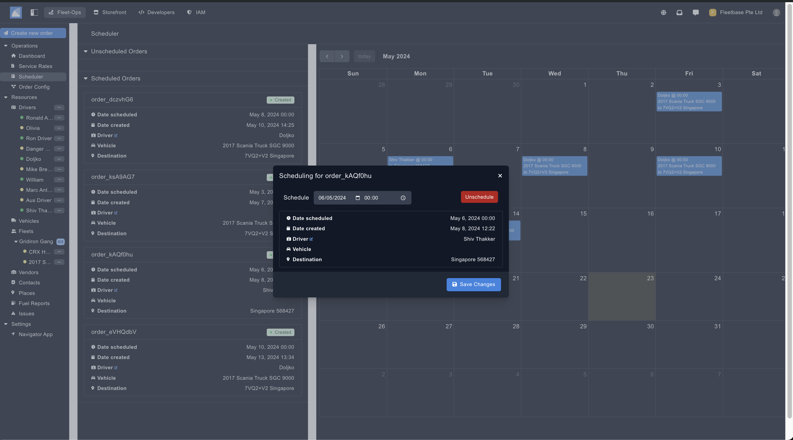

## Overview

The Scheduler shows all of your Unscheduled and Scheduled orders, you can then view all of them in a easy to digest calendar view. 

Additional Zones can be created within the Service Area. 

1. **Unscheduled Orders** - All of these orders have been created but not given a scheduled date for delivery.
2. **Scheduled Orders** - All of these orders have been created with a scheduled delivery date and time. . 
3. **Orders** - These are the orders that have been scheduled, if you want to see more details for a specific order, you can click into it. 

