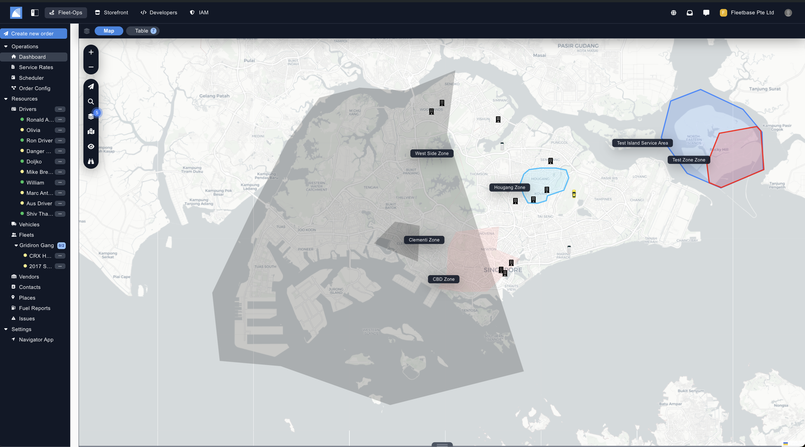
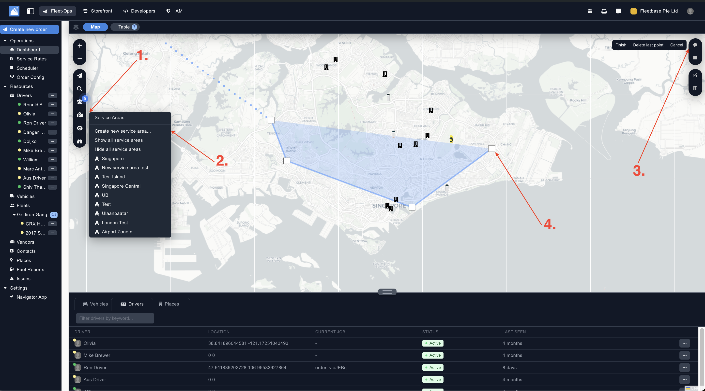
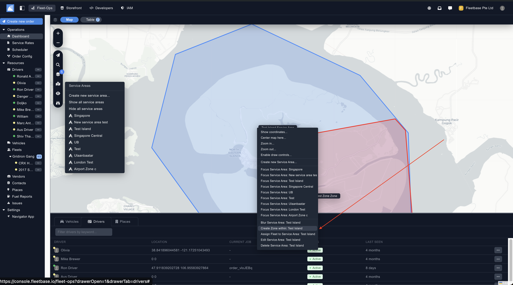

## Overview

Service areas in FleetOps are used to assign fleets, vehicles, drivers and even service rates to. Custom logic can be created on the back end as well, for things like IOT device integrations and geofencing.

Additional Zones can be created within the Service Area. 

### Create Service Area

From the Dashboard section, you can view and create new service areas from the 4th button on the bar on the left hand side. 

Below are the steps needed to create Service Areas & Zones. 

1. **Manage Service Area** - Navigate to the Service Area section. 
2. **Create Service Area** - Click on 'Create New Service Area'. Once you click on this, there will be tools for you to create the service area. 
3. **Select Drawing Tool** - Select the type of drawing tool you would like to use to draw your service area. 
4. **Draw and Confirm** - Use the drawing tool to create the service area you would like to start with. Once you connect the polygon back together, the service area will be created. 

### Create Zones

Zones are geofenced areas within Service Areas. Once the service are has been created, you can Right Click into the service area, and select 'Create Zone'. 

