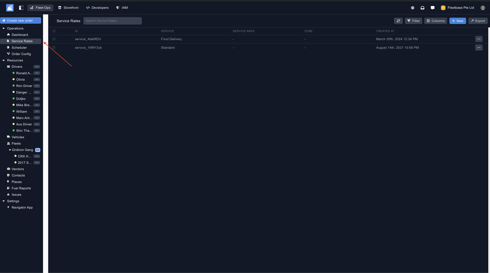
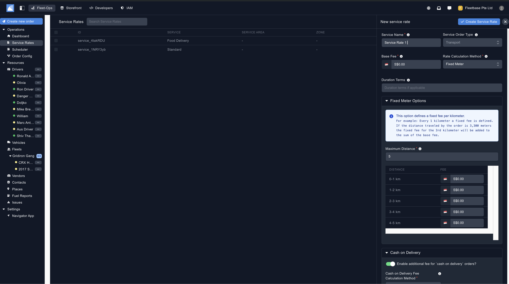

## Overview

Service Rates in Fleetops are used to calculate delivery fees automatically when a new order is created. 

Users can link service rates to specific order types (see Order Configuration section) and even create custom algorithims to calulate service rate fees. 

### Create Service Rates

Once you have navigated to the Service Area section, you can create a new Service Rate by clicking 'New' 

1. **Service Name** - This is the name for your service rate. 
2. **Service Order Type** - Restricting this service rate to the order type means, when you create the order and select the specific service type, only this rate calculation will be used. 
3. **Base Fee** - The standard base fee you want to set for this service rate. 
4. **Rate Calculation Method** 
    - **Fixed Meter** - This option defines a fixed fee per kilometer. 
    - **Per Meter** - this optons allows the service to be calculated per kilometer or meter, this means you define a flat fee which is then multiplied by the distance which can be either meter or kilometer. 
    - **Per Drop-off** - This options defines a dixed fee per drop-offs
    - **Custom Algorithm** - This option is to define a custom calculation for this service's fee with variables. Note that variables must be wrapped in a single curly brace. 
5. **Duration Terms** - You can add additional terms of service regarding duration for this service rate.  
6. **Cash on Delivery**  - Toggle this to enable cash on delivery for orders. 
7. **Peak Hours** - Toggle this to add an additional fee for peak hours. 
8. **Restrict Service**  - Restrict this service to an order type, you can learn more about this in the Order Configuration. 

