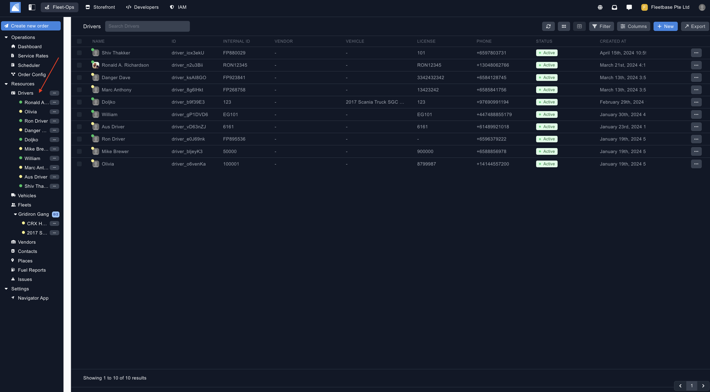
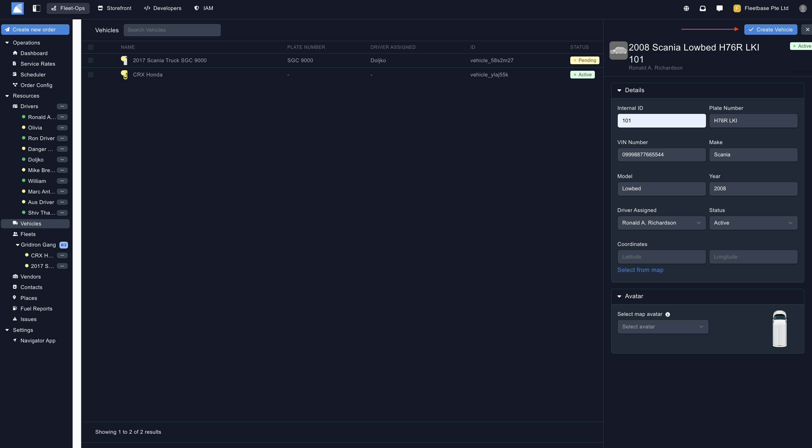
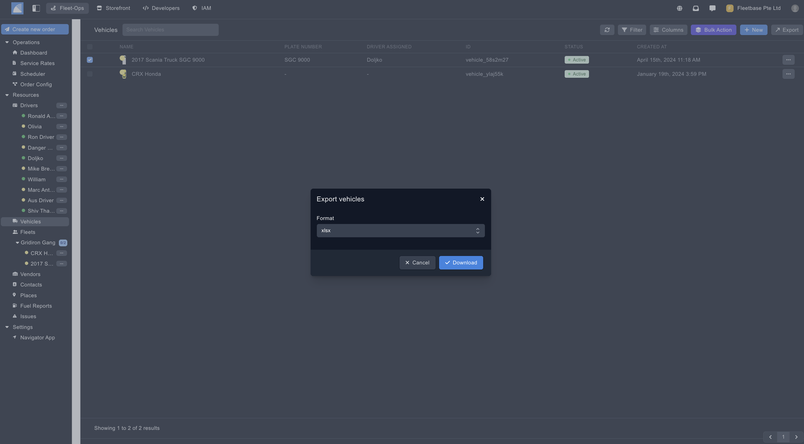

## Overview

Vehicles can be used to assign new orders, vehicles and fleets to. 

### Create Drivers

You can create new orders by clicking on the button on the top of the panel.

1. **Vehicle Details** - Add in the details of the vehicle. 
2. **Avatar** - Select an avatar, this will be displayed when you view the vehicle on the map. 

### Export Vehicles ###

Export vehicles by selecting the drivers and then clicking the 'Export' button. 

