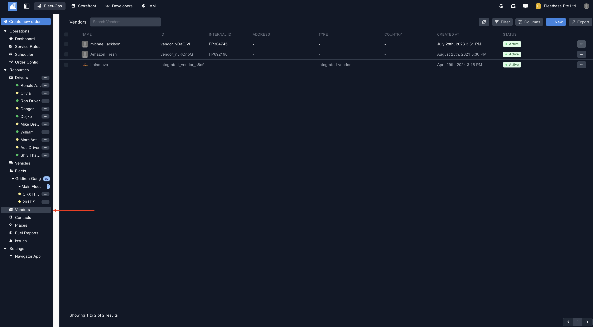
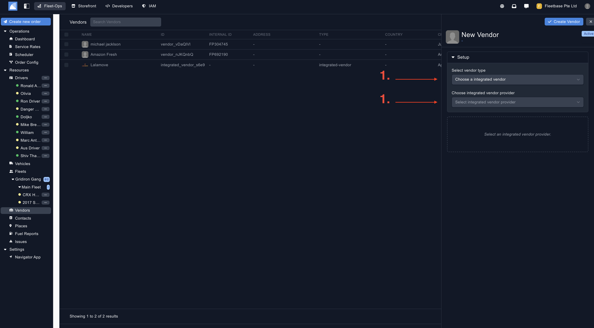
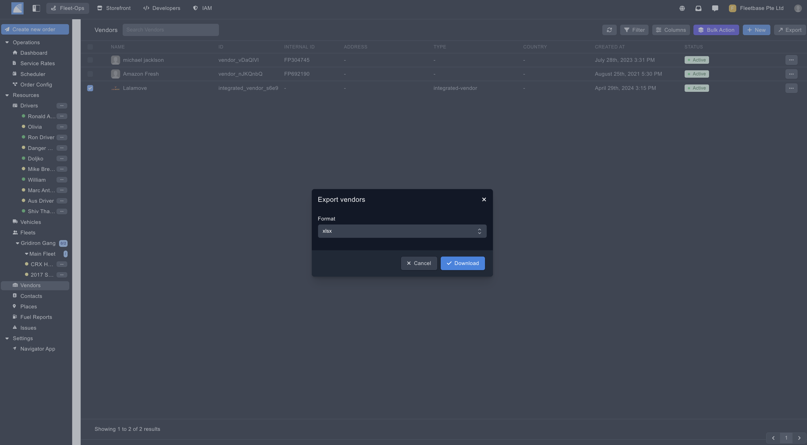

## Overview

Vendors can be defined in multiple ways. 

1. **Vendors** - This can be a 3rd party logistics company that is faciliting the delivery on your behalf, or it can be defined as your customer you are delivery goods on behalf of. 
2. **Integrated Vendors** - Integrated vendors are the same as the above, but there is an exisiting integration either to recieve orders, or assign delivery orders to them, and recieved automated updates. 

### Create Integrated Vendor ###

You can create a new vendor by clicking on the button on the top of the panel.

1. **Select Vendor Type** - Select 'Integrated Vendor'.
2. **Choose Vendor Provider** - Select from the list of integrated vendor, then populate your API details for this vendor. 

### Create Custom Vendor ###

You can create a new vendor by clicking on the button on the top of the panel.

1. **Select Vendor Type** - Select 'Custom Vendor'.
2. **Vendor Details** - Populate the details for your custom vendor. 

### Export Vendors ###

Export vendors by selecting the vendors and then clicking the 'Export' button. 

