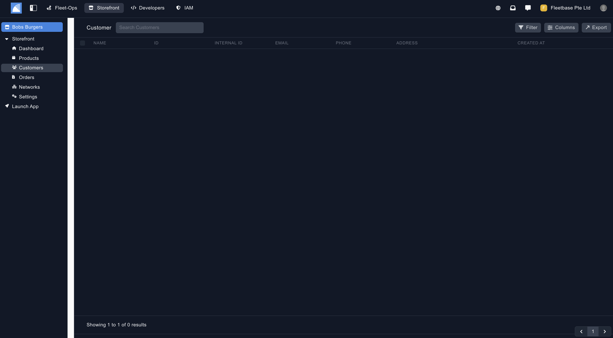

## Customers

View all customers by clicking on the customers section under Resources

### Create Customers

You can create new customers 2 ways:

1. Customers are automatically created when customers order through your Storefront App

2. You can also create Customers manually by clicking ‘New’ on the top right

