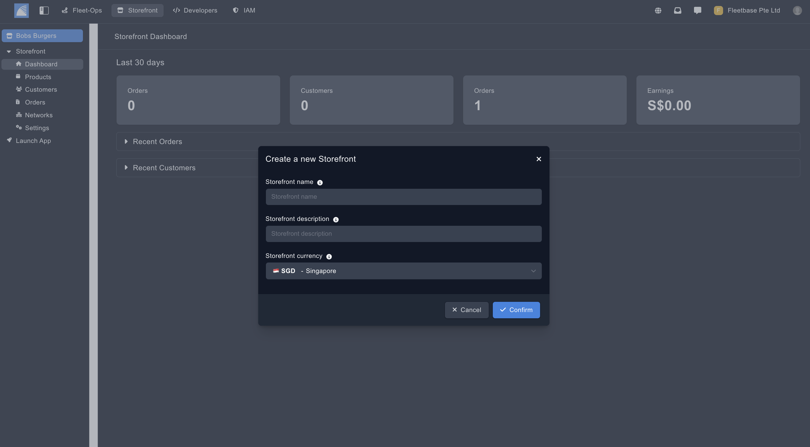

## Overview

Storefront is a headless e-commerce service which functions as an extension within Fleetbase

Fleetbase Storefront provides several API-first approaches to products, carts, categories, customers, and checkout flow giving developers more control over the shopping experience.

This project is to provide an open-sourced hyperlocal shopping app which can be fully customised and adapted to personal and commercial projects.

This Storefront app is built with React Native to provide react native developers a head start building with Fleetbase and Storefront.

The dashboard is where you can manage all of your orders, customers, stores and current earnings.

