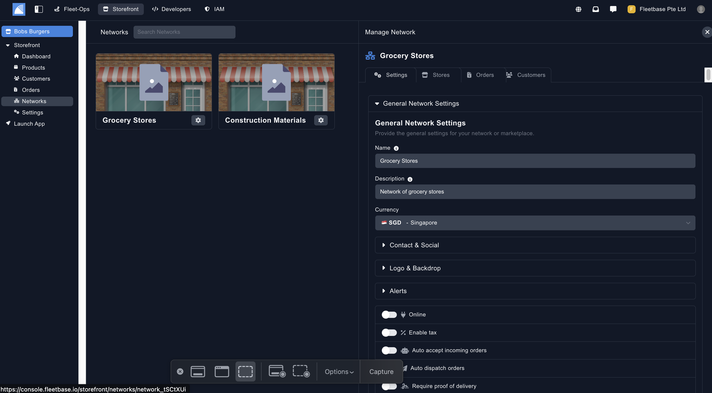
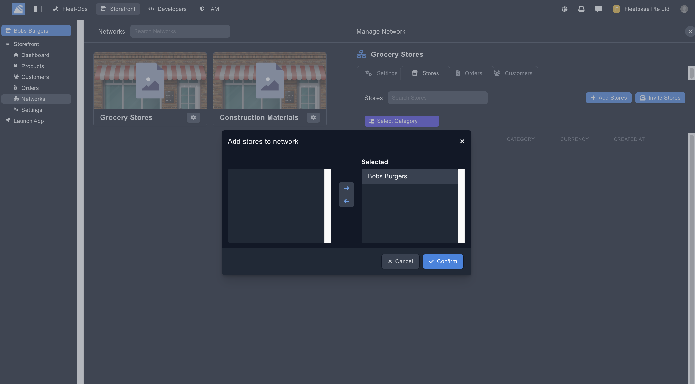
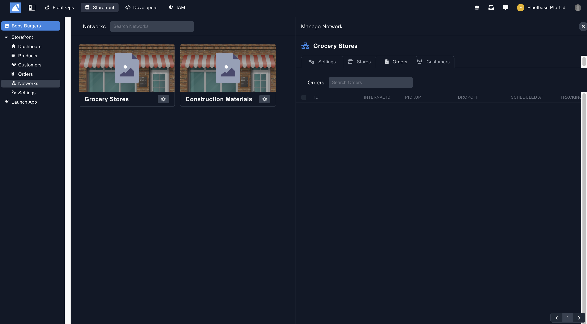

## Networks

Storefront allows you to quickly create marketplaces, enabling multiple storefronts to sell under an umbrella. When you create the network you define your rules and you're able to expand your network through invitations..

### Create Networks

You can create new Network by clicking on the button on the top of the panel.

1. **Name** - The name of the network.
2. **Description** - The description of the network.    
2. **Currency** - The currency of the network. 

### Network Settings

Configure the main settings of your network. 

1. **Name** - The name of your network.
2. **Description** - The description of the network.  
2. **Tags** - Create tags for this Storefront to be selected on your app.  
2. **Currency** - The currency of the network. 
2. **Contact & Social** - Add contact details and social media accounts to be shown on your storefront app.
2. **Logo & Backdrop** - Add in a logo and your backdrop for your network.
2. **Images & Videos** - Add images & videos to your network.  
2. **Alerts** - You can add users in your organisation to receive alerts for new orders that are placed on your Storefront App. 
2. **Online** - Toggle if this network is online and available on your Storefront app.
2. **Enable Tax** - Toggle this to enable a tax percentage on this network orders.
2. **Auto Accept** - Toggle this to auto accept orders when placed by your customers on the Storefront App.
2. **Require Proof of Delivery** - Select whether proof of delivery is required on your network orders. Select the type of POD using the drop down.
2. **Enable Cash on Delivery** - Toggle for cash on delivery option for the orders in the network.
2. **Enable Order PickUp** - Toggle this for the option for your customers to collect orders from your network locations.
2. **Enable Tips** - Toggle for allowing tips on orders.
2. **Enable Delivery Tips** - Toggle for allowing tips for drivers on orders. 
2. **Enable Multi-cart Checkout** - Toggle this to allow customers to order products / services from multiple vendors.
**Enable User Reviews** - Enable your customers to leave reviews on the individual Storefronts.

### Stores ###

You can invite and add multiple stores to your network. 

### Orders ###

View all of the orders that have been recieved from this network. 

### Customers ###

View all of the customers that have been created from this orders in this network. 

