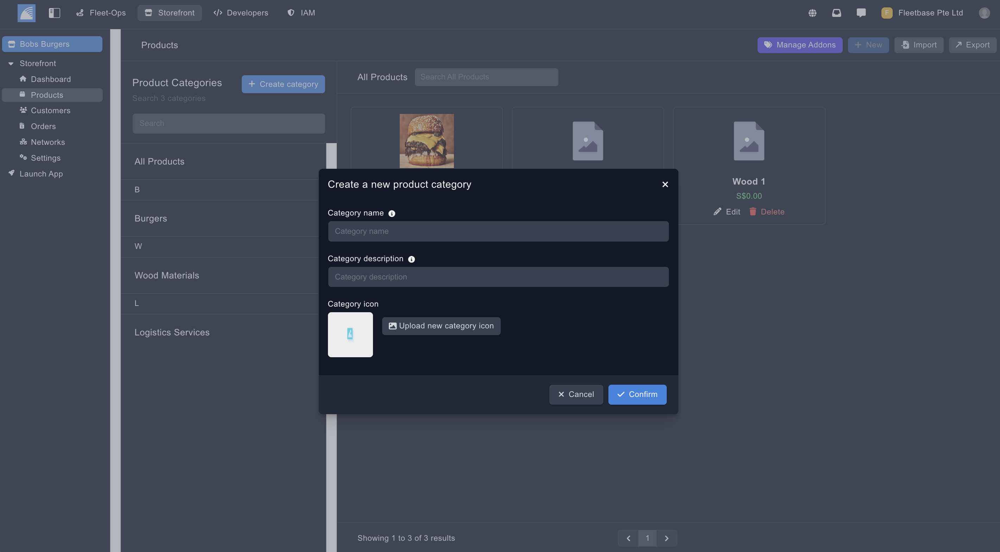

## Products

You can structure your storefront app with categories and products. 

These will be automatically displayed on your mobile app for your customers order or schedule your services.

### Create Categories

You can create categories to add your products or services to.

1. **Create Order** - Click ‘Create Category’ from the Product section
2. **Enter Details** - Enter the details to create the category.

### Create Products & Services

Add products and services to be made available on your Storefront app by clicking ‘New’ inside the product category.

**Details** - Add the specific details for the product or service.
**Product Name** - Name of the product.
**Product Description** - Description of the product.
**Product Tags** - Make tags on your storefront to group products to.
**Product SKU** - the SKU of the product.
**Price** - The price the customer will play for your product.
**Sale Price** - Add a sale price if the product is on sale.
**Metadata** - Add any metadata for this product.
**Translations** - Translate any product details by selecting a language from the dropdown menu.
**This is a Service** - Selecting this will show this product as a service on your Strorefront App.
**The Product is On Sale** - Selecting this will show that this product is on sale.
**This Product is Recommended** - Selecting this will show this product is recommended.
**This Product Is Available** - Selecting this will show that the product is available for purchase.
**Variants** - Adding new variants to products allow your customers to select variations of the product which suits their preference.
**Add-Ons** - Create pre set add ons for your customers to select from.
**Availability** - Set which times this product is available.
**Images** - Add images for this product.
**Youtube** - Add You tube links for this product.
