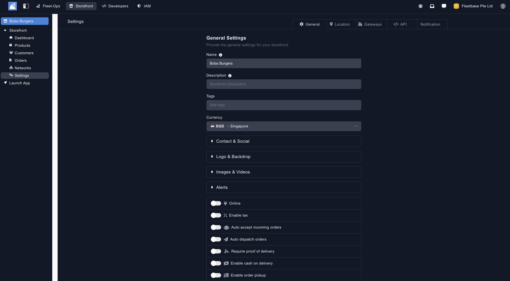
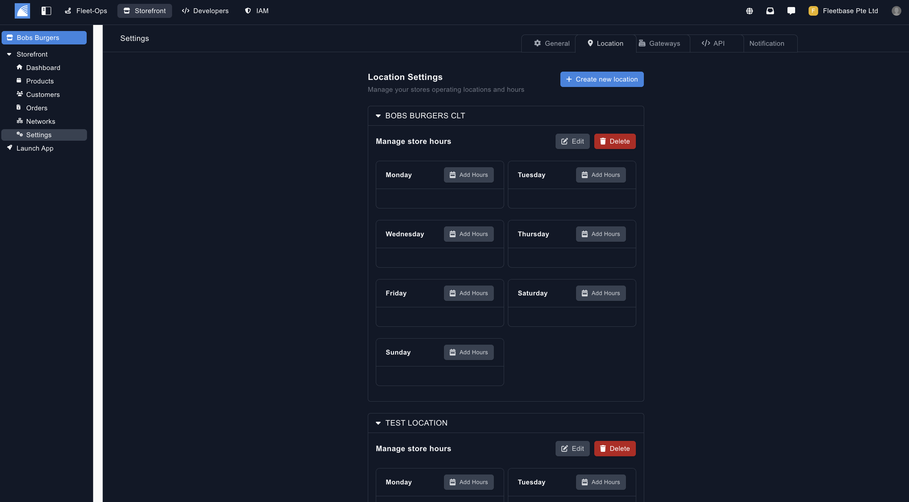
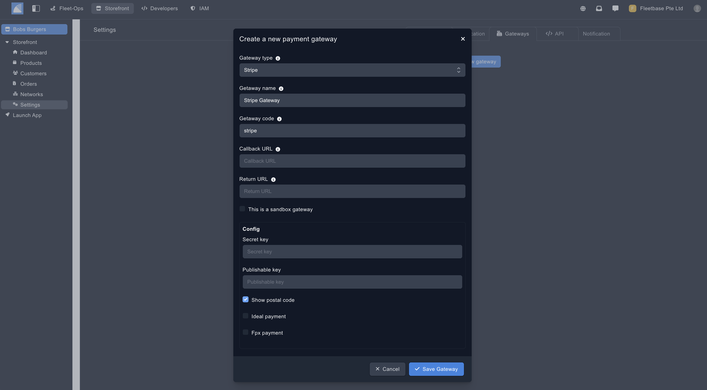
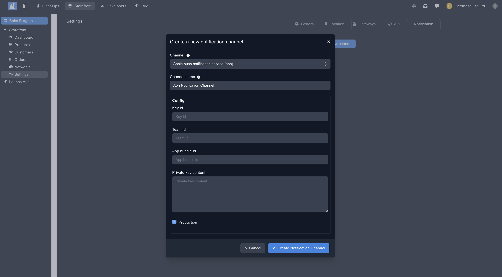

## Settings

The first thing to do in order to launch your Storefront app and so your customers can start purchasing your products or services is to create this storefronts main settings.

### General Settings

The general settings are the backbone of your Store. 

1. **Name** - The name of your Store.
2. **Description** - The description of the Store.  
2. **Tags** - Create tags for this Storefront to be selected on your app.  
2. **Currency** - The currency of the store. 
2. **Contact & Social** - Add contact details and social media accounts to be shown on your storefront app.
2. **Logo & Backdrop** - Add in a logo and your backdrop for your store.
2. **Images & Videos** - Add images & videos to your store.  
2. **Alerts** - You can add users in your organisation to receive alerts for new orders that are placed on your Storefront App. 
2. **Online** - Toggle if this store is online and available on your Storefront app.
2. **Enable Tax** - Toggle this to enable a tax percentage on this stores orders.
2. **Auto Accept** - Toggle this to auto accept orders when placed by your customers on the Storefront App.
2. **Require Proof of Delivery** - Select whether proof of delivery is required on your Storefront orders. Select the type of POD using the drop down.
2. **Enable Cash on Delivery** - Toggle for cash on delivery option for the orders in the store.
2. **Enable Order PickUp** - Toggle this for the option for your customers to collect orders from your Storefront locations.
2. **Enable Tips** - Toggle for allowing tips on orders.
2. **Enable Delivery Tips** - Toggle for allowing tips for drivers on orders. 
2. **Enable Multi-cart Checkout** - Toggle this to allow customers to order products / services from multiple vendors.
**Enable User Reviews** - Enable your customers to leave reviews on the individual Storefronts.

### Locations ###

Locations are the pick up location for the products or services that are purchased from this Storefront.

1. **Create New Locations** - Add your Storefront locations for your customers to order from.
2. **Name** - Create the name of the location.
2. **Add Address** - dd the address of the location.
2. **Add Your Store Hours** - Once you have created the Store location, you can add the timings that the Store location is available. 

### Payment Gateway Settings ###

You can add your own payment gateway specifically for orders which are executed for this Network.

1. **Gateway Type** - Choose from the list of preset gateways or create your own.
2. **Gateway Name** - Create a gateway name. 
2. **Gateway Code** - Create a code that is identifiable for the SDK.
2. **Callback URL** - Add a call back URL.
2. **Return URL** - Add a return URL. 

### Notification Channels ###

Add your own Notification channel for example from Apple Push Notifications. 

